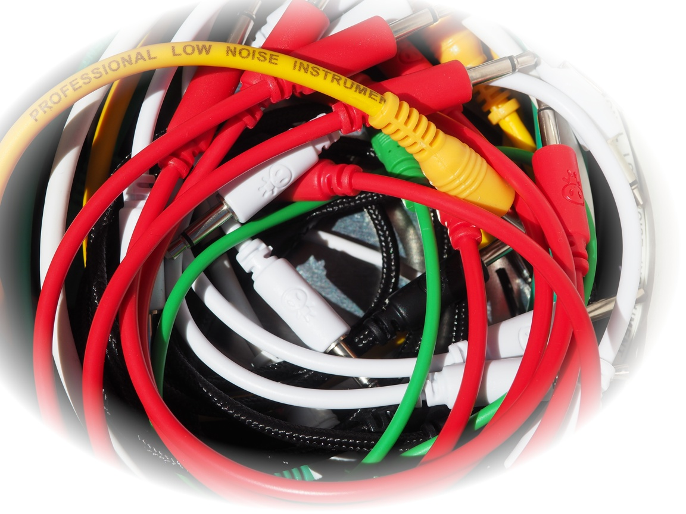

# modular_synths
Information, schematics and software for modular synths

The idea behind this repo is to collect ideas and links concerning electronic music gear using analog modular synths, MIDI modules and maybe FPGAs. And of course to develop own designs.

## General
* Kevin's [Simple DIY Electro Music Projects](https://diyelectromusic.wordpress.com) and his [Youtube Channel](https://www.youtube.com/c/SimpleDIYElectroMusicProjects) provide tons of information on music electronics, especially for Arduino and RPi Pico.
* **Bamanya Brian** from Uganda is a true DIY synth guy, on his [Afrorack Youtube channel](https://www.youtube.com/channel/UCPfBqZQ2P8NqY7puxYzirtw) he shows what he calls [Africa's first home made modular synth](https://youtube.com/watch?v=ov2sEfUv1XY), what it's like to [how to make cheap synth modules](https://youtube.com/watch?v=eELTtd9Bv-k) and demonstrates [some African rhythms on modular synth](https://youtube.com/watch?v=RhWh21uvUZo). He also shows [how to make a MIDI to CV converter for 5$](https://youtube.com/watch?v=UYeJiPWZZNQ).
* [**Notes and Volts**](https://www.notesandvolts.com/) and his [Youtube Channel](https://www.youtube.com/c/NotesAndVolts) have lots of interesting audio projects, mainly built around uCs
* [**Raymond Schouten**](www.rs-elc.nl) has some very reduced but interesting projects for mixed analog / Arduino synthesizers.
* [**Rene Schmitz**]()

## Analog Hardware

## MIDI
### Electrical specification and interfaces
* [MIDI 1.0 DIN Electrical Specification](https://www.midi.org/specifications-old/item/midi-din-electrical-specification), straight from the horse's mouth for 3.3V and 5V. The full spec reveals that the receiver must require less than 5 mA to turn on and that rise and fall times should be less than 2 microseconds, limiting the choice of opto couplers.
* [Kevin's MIDI Cheatsheet](https://diyelectromusic.files.wordpress.com/2021/05/sdemp-midi-connections-cheat-sheet.pdf) is even better with an RX/TX schematic and pinnings
* Notes and Volts [MIDI for the Arduino - Circuit Analysis](https://youtube.com/watch?v=0L7WAMFWSgY) describes the MIDI In circuit in detail for a 6N138 opto coupler in detail, including the biasing resistor for faster turn-off.
* * [Send and Receive MIDI With Arduino](https://www.instructables.com/Send-and-Receive-MIDI-with-Arduino/), basic MIDI connection and operation using Arduino / Arduino IDE.
* [Arduino MIDI shield](http://www.thebox.myzen.co.uk/Hardware/MIDI_Shield.html), another basic MIDI I/O circuit using a PNP transistor to buffer the output (Arduino-IDE).
### MIDI to CV converter
* [MIDI to CV Skull](https://learn.adafruit.com/circuitpython-midi-to-cv-skull), a MIDI to CV converter shaped like a skull (well ...) using an RPI Pico with an MCP4725 I2C 12 bit DAC (CircuitPython)
* [Basic MIDI to CV converter](https://www.hackster.io/janost/diy-good-ol-midi-to-cv-d0e2bf) using an AT Tiny and PWM (C)

## Digital / uC

* [Raspberry Pi Pico: Grundlagen der Energieversorgung / Stromversorgung](https://www.elektronik-kompendium.de/sites/raspberry-pi/2611061.htm), how to power a RPi Pico from (German) via Micro-USB connector, VBUS pin, 3V3 pin or VSYS pin without frying it
* [Arduino Beat Detector](https://projecthub.arduino.cc/mamifero/881c722e-1049-4d82-a91d-56f000ed7b60), using just a coupling capacitor and simple IIR filters to extract beat timing from audio data
* 

## FPGAs
