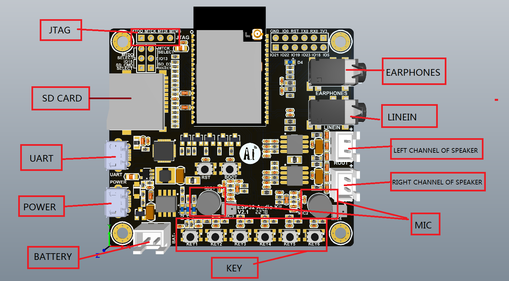

# ESP32-A1S Audio Kit Hardware

https://docs.ai-thinker.com/en/esp32-audio-kit



# ESP32-A1S code examples

[Back to ESP32](./esp32.md)

## Hardware

Phil Schatzmann provides clear info about GPIO connections on the ESP32-A1S board in [The ‘AI Thinker Audio Kit’ Arduino Challenge](https://www.pschatzmann.ch/home/2021/12/06/the-ai-thinker-audio-kit-experience-or-nothing-is-right/).

See also  https://github.com/schreibfaul1/ESP32-audioI2S 

```c++
// SD Card: DATA3 and CMD on-board switches need to be in the on position
#define PIN_AUDIO_KIT_SD_CARD_CS 13  // shared with SW 2!
#define PIN_AUDIO_KIT_SD_CARD_MISO 2
#define PIN_AUDIO_KIT_SD_CARD_MOSI 15
#define PIN_AUDIO_KIT_SD_CARD_CLK  14
// I2S bus
#define PIN_I2S_AUDIO_KIT_MCLK 0
#define PIN_I2S_AUDIO_KIT_BCK 27
#define PIN_I2S_AUDIO_KIT_WS 25
#define PIN_I2S_AUDIO_KIT_DATA_OUT 26
#define PIN_I2S_AUDIO_KIT_DATA_IN 35
// I2C setup to configure ES8388 Codec
#define I2C_MASTER_NUM I2C_NUM_0 // I2C port number for master dev
#define I2C_MASTER_SCL_IO 32     
#define I2C_MASTER_SDA_IO 33   
#define I2CSPEED 100000          // Clock Rate
#define ES8388_ADDR 0x10         // Address of ES8388 I2C port 
// Headphone and PA chip
#define AUXIN_DETECT_GPIO         12
#define HEADPHONE_DETECT 39  // High when no phone is connect (enable GPIO pullup)
#define PA_ENABLE_GPIO 21    // enable power amplifier
// Pushbuttons
#define PIN_KEY1 36
#define PIN_KEY2 13  // shared with SPI_CS (SD Card)
#define PIN_KEY3 19  // shared with LED D5?
#define PIN_KEY4 23
#define PIN_KEY5 18
#define PIN_KEY6 5
#define GREEN_LED_GPIO  22
// #define LED_D5        19 ?

```

[Investigating the AI Thinker AudioKit Audio Input Bug](https://www.pschatzmann.ch/home/2021/12/15/the-ai-thinker-audiokit-audio-input-bug/)

https://www.pschatzmann.ch/home/2020/05/22/synthesizer-for-the-esp32/

## Generated sine streamed to ES8388 codec using AudioTools and ES8388 libraries

In the following [code example](https://github.com/thaaraak/es8388/blob/master/examples/streams-generator-i2s/streams-generator-i2s.ino), a sine generator delivers an I2S stream to the DAC of the ES8388 codec on the ESP32-A1S board. The generation of the sine I2S stream is handled by the [arduino-audio-tools](https://github.com/pschatzmann/arduino-audio-tools) library (Phil Schatzmann), the ES8388 codec is configured with the [es8388](https://github.com/thaaraak/es8388/) library (Thraak) which requires the Adafruit BusIO library for addressing the I2C interface. The latter can be installed directly from the Arduino Library Manager, the other two need to downloaded as ZIP files or cloned from theit repos.

```c++
/* https://github.com/thaaraak/es8388/blob/master/examples/streams-generator-i2s/streams-generator-i2s.ino
 * with some additional comments
 *
 * This file builds upon 
 * @file streams-generator-i2s.ino
 * @author Phil Schatzmann
 * @brief see https://github.com/pschatzmann/arduino-audio-tools/blob/main/examples/examples-stream/streams-generator-i2s/README.md 
 * @copyright GPLv3
 */
 
#include "AudioTools.h"    // Phil Schatzmann
#include "es8388.h"        // Thraak

uint16_t sample_rate=22000;                        // Samplerate in Hz for generated sine and for DAC
uint8_t channels = 2;                              // The stream will have 2 channels 
SineWaveGenerator<int16_t> sineWave(20000);        // subclass of SoundGenerator with max amplitude of 32000
GeneratedSoundStream<int16_t> sound(sineWave);     // Stream generated from sine wave
I2SStream out; 
StreamCopy copier(out, sound);                     // copies generated sound to i2s stream to DAC

uint16_t bits_per_sample = 16; // or try with 24 or 32

// Arduino Setup
void setup(void) {  
  // Open serial connection for logging
  Serial.begin(115200);
  while(!Serial);
  AudioLogger::instance().begin(Serial, AudioLogger::Error);

  // Input/Output Modes
  es_dac_output_t output = (es_dac_output_t) ( DAC_OUTPUT_LOUT1 | DAC_OUTPUT_LOUT2 | DAC_OUTPUT_ROUT1 | DAC_OUTPUT_ROUT2 );
  es_adc_input_t input = ADC_INPUT_LINPUT2_RINPUT2;
  //  es_adc_input_t input = ADC_INPUT_LINPUT1_RINPUT1;

  // Setup I2C interface ...
  TwoWire wire(0);
  wire.setPins( 33, 32 ); //  SDA, SCL
  // ... for configuring the ES8388 codec from the ESP32
  es8388 codec;
  codec.begin( &wire );
  codec.config( bits_per_sample, output, input, 90 );
  
  // start I2S
  Serial.println("starting I2S...");
  auto config = out.defaultConfig(TX_MODE);
  config.sample_rate = sample_rate; 
  config.bits_per_sample = bits_per_sample; 
  config.channels = 2;
  config.i2s_format = I2S_STD_FORMAT;
  config.pin_ws = 25;                  // word select, word clock or LR clock 
                                       //  = sampling frequency f_S. Defines the frames.     
  config.pin_bck = 27;                 // serial clock or bit clock, f = f_S * W * N_channels
  config.pin_data = 26;                // ADC serial data out
  config.pin_data_rx = 35;             // DAC serial data in
  config.pin_mck = 0;                  // master clock, typically 32 ... 256 x word clock
                                       // other clocks are derived from this
  out.begin(config);

  // Setup sine wave
  sineWave.begin(channels, sample_rate, 400);
  Serial.println("started...");
}

// Arduino loop - copy sound to out 
void loop() {
  copier.copy();
}
```

## Generated sine streamed to ES8388 codec using AudioTools and Arduino-Audio-Driver

The following example uses once more the [arduino-audio-tools](https://github.com/pschatzmann/arduino-audio-tools) library to generate a stream of I2S data with a sinusoidal signal. The AudioBoard and I2SCodecStream classes of the[arduino-audio-driver](https://github.com/pschatzmann/arduino-audio-driver) library are used for hardware setup: 

```c++
/**
 * @brief We define a custom board with the i2c and i2s pins and output_device a sine
 * with the help of the AudioTools I2SCodecStream
 * @author phil schatzmann
 */

#include "AudioTools.h" // install https://github.com/pschatzmann/arduino-audio-tools
#include "AudioLibs/I2SCodecStream.h" // install https://github.com/pschatzmann/arduino-audio-driver

// I2C
#define SDAPIN              33 // I2C Data,  ESP32-A1S 
#define SCLPIN              32 // I2C Clock, ESP32-A1S 
#define I2CSPEED        100000 // I2C Clock Rate
#define ES8388ADDR        0x10 // Address of ES8388 I2C port

// I2S, configuration for the ES8388 connections
#define MCLKPIN              0 // Master Clock
#define BCLKPIN             27 // Bit Clock
#define WSPIN               25 // Word select
#define DOPIN               26 // This is connected to the DAC input DI of ES8388 (MISO)
#define DIPIN               35 // This is connected to the ADC output DO of ES8388 (MOSI)

AudioInfo                     audio_info(44200, 2, 16);                // sampling rate, # channels, bit depth
SineWaveGenerator<int16_t>    sine_wave(32000);                        // amplitude
GeneratedSoundStream<int16_t> sound_stream(sine_wave);                 // sound generator
DriverPins                    my_pins;                                 // board pins
AudioBoard                    audio_board(AudioDriverES8388, my_pins); // from audio-driver
I2SCodecStream                i2s_out_stream(audio_board);             // i2s coded
StreamCopy                    copier(i2s_out_stream, sound_stream);    // stream copy sound generator to i2s codec
TwoWire                       myWire = TwoWire(0);                     // universal I2C interface

void setup() {
  // Setup logging
  Serial.begin(115200);
  AudioLogger::instance().begin(Serial, AudioLogger::Warning);
  LOGLEVEL_AUDIODRIVER = AudioDriverWarning;
  delay(2000);

  Serial.println("Setup starting...");

  Serial.println("I2C pin ...");
  my_pins.addI2C(PinFunction::CODEC, SCLPIN, SDAPIN, ES8388ADDR, I2CSPEED, myWire);
  Serial.println("I2S pin ...");
  my_pins.addI2S(PinFunction::CODEC, MCLKPIN, BCLKPIN, WSPIN, DOPIN, DIPIN);

  Serial.println("Pins begin ..."); 
  my_pins.begin();

  Serial.println("Board begin ..."); 
  audio_board.begin();

  Serial.println("I2S begin ..."); 
  auto i2s_config = i2s_out_stream.defaultConfig();
  i2s_config.copyFrom(audio_info);  
  i2s_out_stream.begin(i2s_config); // this should apply I2C and I2S configuration

  // Setup sine wave
  Serial.println("Sine wave begin...");
  sine_wave.begin(audio_info, N_B4); // 493.88 Hz

  Serial.println("Setup completed ...");
}

// Arduino loop - copy sound to out
void loop() { copier.copy(); }
```

[Back to ESP32](./esp32.md)