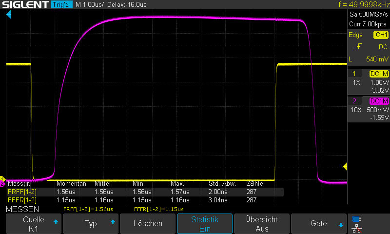
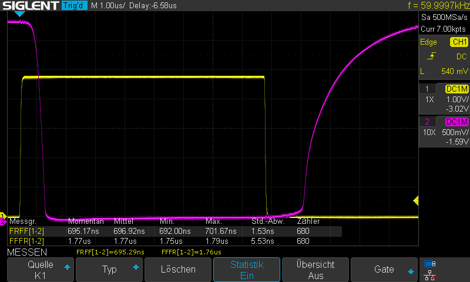

# MIDI - the physical interface
## Electrical specification and interfaces
* [MIDI 1.0 DIN Electrical Specification](https://www.midi.org/specifications-old/item/midi-din-electrical-specification), straight from the horse's mouth for 3.3V and 5V. The full spec reveals that the receiver must require less than 5 mA to turn on and that rise and fall times should be less than 2 microseconds, limiting the choice of opto couplers.
* [Kevin's MIDI Cheatsheet](https://diyelectromusic.files.wordpress.com/2021/05/sdemp-midi-connections-cheat-sheet.pdf) is even better with an RX/TX schematic and pinnings

## Opto-Couplers at the RX side
MIDI interfaces always use opto couplers at the receive side - at least I haven't seen a MIDI interface without one yet. There a several good reasons for the galvanic isolation achieved with an opto coupler:
* MIDI equipment running at different earth potentials together with [ground loops](https://en.wikipedia.org/wiki/Ground_loop_(electricity)) may create potentially destructive equalizing currents that are better kept away from the precious electronics of your vintage synth.
* The same ground loops may also result in injection of 50 Hz hum into your audio path. The German term "Brummschleife", translated *hum loop*, reflects this frequent result of a ground loop.
* Ground loops may also introduce noise creating transmission errors.

Notes and Volts [MIDI for the Arduino - Circuit Analysis](https://youtube.com/watch?v=0L7WAMFWSgY) describes the MIDI In circuit in detail for a 6N138 opto coupler in detail, including the biasing resistor for faster turn-off. Even more details on opto coupler behaviour can be found in [Opto-couple confusion – 6N137 or 6N138?](https://gr33nonline.wordpress.com/2019/05/15/opto-couple-confusion-6n137-or-6n138/). Some common opto couplers are:
  * **4N37 / 4N38:** Built with a single photo transistor,turn-on and turn-off times are specified around 10 us. Don't use these.
  * **6N137 / VO2601 / VO2611:** Specified for 5 mA LED current, featuring a fast photo diode receiver (t_r typ. 23 ns, t_f typ. 7 ns) and a Shottky clamped open collector output. Min. VCC is specified with 5 V. VO2630 / VO2631 / VO4661 have two channels.
  * **6N138 / 139:** Specified for LED currents in the range 0.5 ... 12 mA and min. current transfer ratios of 300% (6N138) resp. 500% (6N139) with a photo diode / darlington receiver. Min. VCC is specified as 5V, but the collector of the output transistor (Pin 6) can be connected to 3.3V via a pullup resistor in the range 270 ... 470 Ohm. The base of the output transistor (Pin 7) should be tied to ground with 4k7 resistor to speed up turn-off times. Propagation delays are specified with wide variations but 2 us are achievable.
  * **HC11L1:** Receiver is built with a foto transistor, still non-saturated turn-on and turn-off times around 3 us are specified. A non-saturated current transfer ratio of around 100 % is specified. I've obtained good results with this.

  
  
  *6N138 with 3V3 supply, R_LED = 750 Ohm (5 mA), R_RX = 470 Ohm and R_Base = 4k7*
  
  
  
  *6N138 with 3V3 supply, R_LED = 750 Ohm (5 mA), R_RX = 470 Ohm and R_Base = 10k*

  
  
  *6N138 with split 5V / 3V3 supply, R_LED = 750 Ohm (5 mA), R_RX = 470 Ohm and R_Base = infinity*

## Transmit side
* [Send and Receive MIDI With Arduino](https://www.instructables.com/Send-and-Receive-MIDI-with-Arduino/), basic MIDI connection and operation using Arduino / Arduino IDE.
* [Arduino MIDI shield](http://www.thebox.myzen.co.uk/Hardware/MIDI_Shield.html), another basic MIDI I/O circuit using a PNP transistor to buffer the output (Arduino-IDE).

