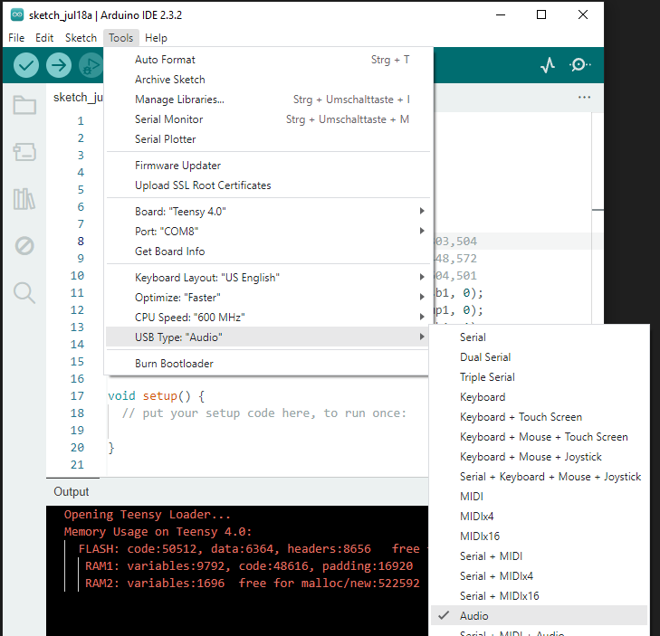

[Back to main](./README.md)

# Hardware

Recent Teensy microcontroller boards are build around 32 bit ARM controllers (see [details](https://www.pjrc.com/teensy/techspecs.html)):<<

- Teensy 3.6 (deprecated) with a 180 MHz Cortex M4F controller (32 bit floating point unit, DSP instructions), 256k RAM and 1024k flash, two twelve 12 bit DACs
- Teensy 4.0 with a 600 MHz Cortex M7 controller (32 and 64 floating point unit, DSP), 1024k RAM and 1984k flash, no DAC
- Teensy 4.1 with a 600 MHz Cortex M7 controller (32 and 64 floating point unit, DSP), 1024k RAM and 7936k flash, no DAC

- [Pinout](https://www.pjrc.com/teensy/pinout.html) and [schematic](https://www.pjrc.com/teensy/schematic.html) for all Teensy boards

- [Pinout](https://www.pjrc.com/audio-shield-for-teensy-4-0/) and [schematic](https://www.pjrc.com/store/teensy3_audio.html) for Teensy 4.0 audio shield

# Software

## Teensyduino

In order to use the Arduino IDE to upload binaries to Teensy boards, you need to install the [Teensyduino](https://www.pjrc.com/teensy/td_download.html) add-on in the Arduino IDE as described in this [tutorial](https://www.pjrc.com/teensy/tutorial.html).

Add the Teensy URL under `File -> Preferences -> Additional boards manager URLs` add `https://www.pjrc.com/teensy/package_teensy_index.json`, separated by a comma without blanks from other entries (if any).

Next, in the main Arduino window, open `Boards Manager` by clicking the left-side board icon, search for "teensy", and click "Install" Teensy (for Arduino IDE 2.04 or later). This covers all Teensy boards.

Under Linux, you need to download [00-teensy.rules](http://www.pjrc.com/teensy/00-teensy.rules) and copy it to your rules via

`sudo cp 00-teensy.rules /etc/udev/rules.d/00-teensy.rules`

in order to give non-root users access to the Teensy via the USB port. This text file contains some more info and trouble shooting tips.

# Synth and Audio Projects with Teensy Microcontroller Boards

https://www.pjrc.com/store/audio_tutorial_kit.html

## USB Audio for Teensy

There are two good reasons for choosing the Teensy to create audio applications: Its fast (480 Mbit/s) USB port and the [Audio System Design Tool](https://www.pjrc.com/teensy/gui/), a browser based UI for drawing sources and sinks to process 16 bit 44.1 kHz streaming audio. "Export" will generate C++ code that can be copied into a code editor.

Before compiling, you need to configure the USB interface for audio under
[img](img/teensy_arduino_usb_audio_settings.png)

Before uploading the binary to the Teensy board, you need to select the board under Tools -> Ports -> [teensy ports] .

In Audacity, select "Teensy Audio" for input and output. Then, you can use a stereo track with a recording or a generated signal as a source and another stereo track for recording the signal that has been processed by the Teensy.

[Notes and Volts, "Teensy as a USB audio interface"](https://youtu.be/om9yePUsYps)

https://www.pjrc.com/store/teensy41.html (usb audio)

https://forum.pjrc.com/index.php?threads/usb-audio-for-teensy-3-0.24309/page-2

## CCRMA Course "Physical Interaction Design for Music" (Spring 2021)
by Romain Michon and Douglas McCausland

https://ccrma.stanford.edu/courses/250a-spring-2021/

Part of the course is a lab with a focus on music and the Teensy:

- [Lab 1: Faust Basics and Digital Musical Instrument](https://ccrma.stanford.edu/courses/250a-spring-2021/labs/1/)
- [Lab 2: Embedded Audio DSP with Faust and the Teensy](https://ccrma.stanford.edu/courses/250a-spring-2021/labs/2/) This also explains how to connect the Teensy and the Teensy audio shield via stackable headers
- [Lab 3: Sensors and Physical Interface Design (with Teensy)](https://ccrma.stanford.edu/courses/250a-spring-2021/labs/3/)
- [Lab 4: "Hybrid" Instruments](https://ccrma.stanford.edu/courses/250a-spring-2021/labs/4/)

## USB MIDI for Teensy

[Back to main](./README.md)
