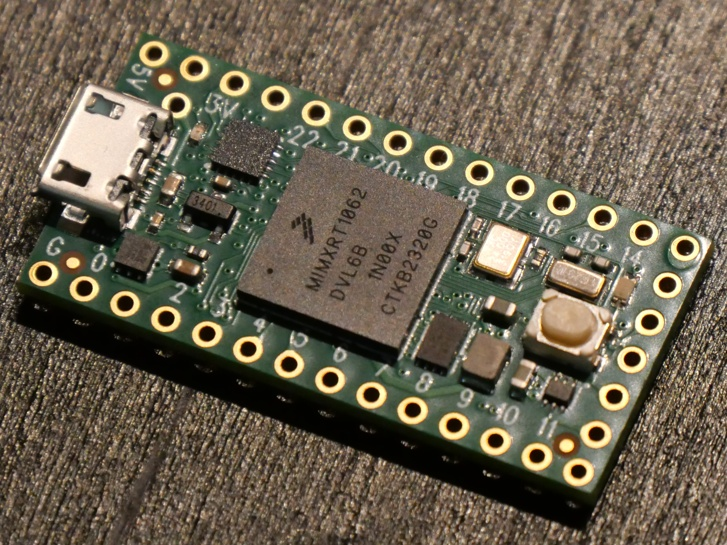
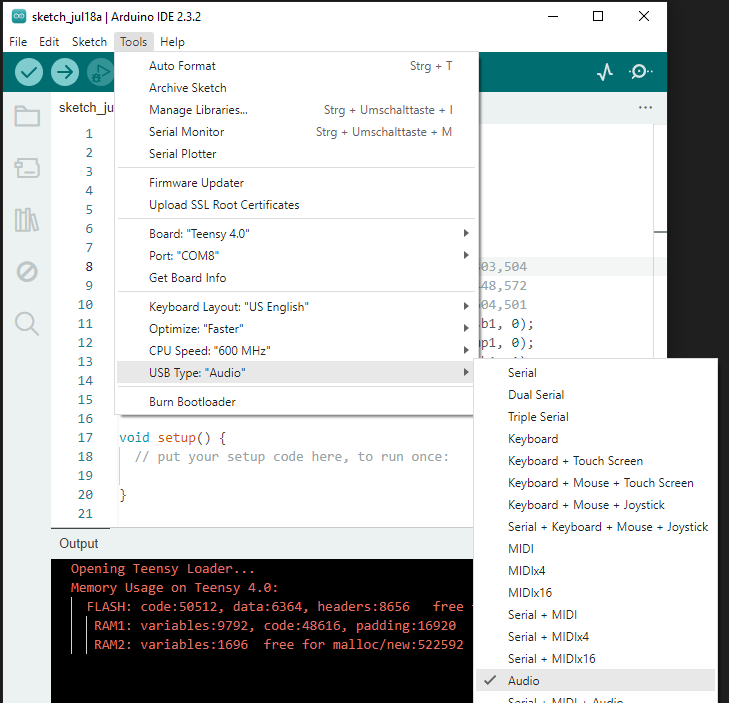

[Back to main](../README.md)

---

# Hardware
Teensy boards are widely used low-cost, high-performance ARM M7 based microcontroller boards. Besides general purpose projects, Teensies are frequently used for audio applications due to good software libraries and a fast USB port.

Recent Teensy microcontroller boards are build around 32 bit ARM controllers (see a [comparison](https://www.pjrc.com/teensy/techspecs.html) and details on [Teensy 4.0](https://www.pjrc.com/store/teensy40.html) and [Teensy 4.1](https://www.pjrc.com/store/teensy41.html)):

- Teensy 3.6 (deprecated) with a 180 MHz Cortex M4F controller (32 bit floating point unit, DSP instructions), 256k RAM and 1024k flash, two twelve 12 bit DACs
- Teensy 4.0 with a 600 MHz Cortex M7 controller (32 and 64 floating point unit, DSP), 1024k RAM and 1984k flash, no DAC
- Teensy 4.1 with a 600 MHz Cortex M7 controller (32 and 64 floating point unit, DSP), 1024k RAM and 7936k flash, no DAC

- [Pinout](https://www.pjrc.com/teensy/pinout.html) and [schematic](https://www.pjrc.com/teensy/schematic.html) for all Teensy boards

- [Pinout](https://www.pjrc.com/audio-shield-for-teensy-4-0/) and [schematic](https://www.pjrc.com/store/teensy3_audio.html) for Teensy 4.0 audio shield

# Software

## Teensyduino

In order to use the Arduino IDE to upload binaries to Teensy boards, you need to install the [Teensyduino](https://www.pjrc.com/teensy/td_download.html) add-on in the Arduino IDE as described in this [tutorial](https://www.pjrc.com/teensy/tutorial.html).

Add the Teensy URL under `File -> Preferences -> Additional boards manager URLs` add `https://www.pjrc.com/teensy/package_teensy_index.json`, separated by a comma without blanks from other entries (if any).

Next, in the main Arduino window, open `Boards Manager` by clicking the left-side board icon, search for "teensy", and click "Install" Teensy (for Arduino IDE 2.04 or later). This contains all Teensy boards.

Libraries are installed under `.arduino15/packages/teensy` (Linux)

Under Linux, you need to download [00-teensy.rules](http://www.pjrc.com/teensy/00-teensy.rules) and copy it to your rules via

`sudo cp 00-teensy.rules /etc/udev/rules.d/00-teensy.rules`

in order to give non-root users (write) access to the Teensy via the USB port. This text file contains some more infos and trouble shooting tips.

## Audio System Design Tool

The [Audio System Design Tool](https://www.pjrc.com/teensy/gui/) is a browser based (NodeJS) UI for drawing sources and sinks to exchange streaming audio packets. "Export" will generate boilerplate C++ code for the objects and the wiring that can be copied into a code editor. Objects can be renamed by double-clicking them. "Import" recreates the graphic representation from the C++ code when the xy coordinate comments have not been deleted.

The design tool is also installed locally together with TeensyDuino under [.arduino15/packages/teensy/hardware/avr/1.59.0/libraries/Audio/gui/index.html](.arduino15/packages/teensy/hardware/avr/1.59.0/libraries/Audio/gui/index.html) and is started by opening the file with a browser.

Under Windows, this is most likely under `C:\Users\<USER_NAME>\Arduino15\...`

## Faust

[Faust](../faust.md) is a functional programming language for sound synthesis and audio processing. [faust2teensy](https://faustdoc.grame.fr/manual/tools/#faust2teensy) creates an object that can be used with the Teensy audio library. 

See also the tutorial [Faust for Teensy](https://faustdoc.grame.fr/tutorials/teensy/) and the presentation at Grame 2020 [Making Faust run on Hardware - Building a simple prototype Poly Synth with Faust DSP, Arduino, Teensy 4.0, and Modular](https://www.youtube.com/live/EhgaFutFbQg?feature=shared) with [resources on GitHub](https://github.com/makingsoundmachines/Faust-on-Teensy).

# Synth and Audio Projects with Teensy Microcontroller Boards

## USB Audio for Teensy

The Teensy boards have a fast (480 Mbit/s) USB port, ideally suited for audio applications. Configure the USB interface type for "Audio" (or "Audio/Serial/ ...")

before starting compilation.

Select the board under `Tools -> Ports -> [teensy ports]` before uploading.

In Audacity, select "Teensy Audio" for input and output. Then, you can use a stereo track with a recording or a generated signal as a source and another empty stereo track for recording the signal that has been processed by the Teensy.

See also:

- [Notes and Volts, "Teensy as a USB audio interface"](https://youtu.be/om9yePUsYps)
- [PJRC, "Teensy 4.0 Development Board"](https://www.pjrc.com/store/teensy40.html) (-> "USB Device")

## Teensy Audio Tutorial Kit by Paul Stoffregen and Alysia Dynamik

This [workshop](https://www.pjrc.com/store/audio_tutorial_kit.html) by the creator of the Audio Library himself gives a walkthrough through the whole process of creating audio applications with the Teensy with a detailled treatment of FFT - highly recommended!

The page contains [PDF](https://www.pjrc.com/store/workshop_t4.pdf) and [video tutorial](https://youtu.be/wqt55OAabVs) by Paul Stoffregen as well as actual unrehearsed workshop videos, showing also what can go wrong.

## CCRMA Course "Physical Interaction Design for Music" (Spring 2021)
by Romain Michon and Douglas McCausland

https://ccrma.stanford.edu/courses/250a-spring-2021/

Part of the course is a lab with a focus on music and the Teensy:

- [Lab 1: Faust Basics and Digital Musical Instrument](https://ccrma.stanford.edu/courses/250a-spring-2021/labs/1/)
- [Lab 2: Embedded Audio DSP with Faust and the Teensy](https://ccrma.stanford.edu/courses/250a-spring-2021/labs/2/) This also explains how to connect the Teensy and the Teensy audio shield via stackable headers
- [Lab 3: Sensors and Physical Interface Design (with Teensy)](https://ccrma.stanford.edu/courses/250a-spring-2021/labs/3/)
- [Lab 4: "Hybrid" Instruments](https://ccrma.stanford.edu/courses/250a-spring-2021/labs/4/)

## Teensy Experiments

The following experiments all use the Teensy 4.0 board, see the following image for pinout ([(c) www.pjrc.com](https://www.pjrc.com/teensy/pinout.html)):

Some experiments stream audio via the USB interface, requiring only the Teensy board, some use the Teensy Audio Shield for analog input and / or output. With the help of the Audio System Design Tool (GUI), sources and sinks can be exchanged easily.

- [Audio pass-through via USB - setup and debugging](teensy_usb_audio_loopback.md): Receive an audio USB stream from your computer and send it back. Use Audacity to stream, receive and analyze audio signals. Debug the code by printing audio peak values to the serial console of the Arduino IDE. This experiment also describes Audacity setup.
- [Audio shield as a headphone DAC](teensy_usb_dac_audio.md): Setup the Codec on the Teensy audio shield and route an audio stream from the USB interface to it via I2S. Output the analog signal to the headphone output and control its volume with a potentiometer. Optionally, the signal can be output to USB in parallel.
- [Audio pass-through using audio shield and stereo effect](teensy_adc_dac_audio_stereo.md): Read an audio stream from the ADC of the Codec on the Teensy audio shield and write it back to the DAC of the Codec, passing the analog signal to the headphone output. The stereo signal is panned between left and right channel with a slow sinusoidal signal, using the multiplier and the mixer block.
- [Playing a sound file from SD card with reverb](teensy_audio_dac_sd_card_reverb.md): Play a sound file from an SD card (requires audio shield or Teensy 4.1) and / or analog input / USB input and apply reverb.
- [Generate pink noise and a sine signal](teensy_usb_audio_sine.md): Generate pink noise on one channel and a sine signal on the other channel and send the signal via USB audio to your computer.
- [Audio filtering with FIR filters](teensy_usb_audio_fir_filter.md)
- [Audio filtering with biquad IIR filters](teensy_usb_audio_iir_filter_biquad.md) (under development)
- [Audio filtering with state-variable IIR filters](teensy_usb_audio_iir_filter_state_variable.md) (under development)
- [FFT Analysis of audio stream](teensy_audio_fft_analysis.md) (under development)
- [Creating custom audio objects with AudioRecordQueue and AudioPlayQueue](teensy_audio_custom_queue.md) (under development)
- [Creating custom audio objects by deriving from AudioStream](teensy_audio_custom_stream.md) (under development)
- Requantization

### Youtube Videos

**Synthux Academy** gives a [one hour walkthrough](https://youtu.be/u694SVc5Bys) for beginners on how do build an LDR controlled Teensy Synth.

The Youtube playlist [Teensy Audio Projects - Sound Processing and Playback](https://youtube.com/playlist?list=PLDnEejiR3mBwSYLSxqluI-c01M04JyP2c&si=lmTB3covy8xjWrW0) of [**GadgetReboot**](https://www.youtube.com/@GadgetReboot) describes more complex examples:

- [Teensy Audio Part 1: How to Use the GUI Design Tool - Play wav Files from SD Card](https://youtu.be/L4gE3RoatlI). A good introduction to the general setup, the GUI tool, the Teensy audio shield, debouncers ...
- [Teensy Audio Part 2: Chorus and Flange Audio Effects](https://youtu.be/DUJS2dYhLfs)

[**Matt Venn**](https://www.youtube.com/@matthewvenn) uses PlatformIO instead of the Arduino IDE:

- [Teensy FX part 1](https://youtu.be/fyk4Z21knqk) describing a stereo delay / reverb effect that is controlled via the serial interface and a PyQT GUI on the PC.
- [Teensy FX part 2- board design](https://youtu.be/zHr6EKKnGfY) shows how to design a hardware interface instead of the PyQT GUI.

[**Nuts and Volts**](https://www.youtube.com/@NotesAndVolts) constructs a complete synth in this 11 part [YouTube series](https://youtu.be/UJcZxyB5rVc) - very nice!

## USB MIDI for Teensy

---

[Back to main](../README.md)
