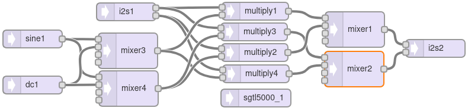

[Back to Teensy](./teensy.md)

---

# Analog input and output with stereo effect

This example shows how to read an audio stream from the ADC of the Codec on the Teensy audio shield and write it back to the DAC of the Codec, passing the analog signal to the headphone output. The stereo signal is panned between left and right channel with a slow sinusoidal signal, using the multiplier and the mixer block. The implemented formula is

```math
OUT = 0.5 * \left(L \cdot (1 + \sin(2 \pi f_1 t)) + R\cdot (1 - \sin(2 \pi f_1 t)) \right)
```

where $f_1$ is the low frequency rotating the stereo signal in your head.

## Teensy GUI



## Code

The code for the "wiring" of the audio streaming components has again been generated by and exported from the Teensy Audio System Design Tool. It can be imported back to the Audio System Tool when the xy coordinate comments have not been deleted.

In the `setup()` part, the codec and serial communication for debugging are initialized as well as the other components.

In the `loop()` part, the analog input at pin 15 is read every 100 ms. Its value is scaled from 0 ... 1023 to 0 ... 0.8 and used to control the headphone volume. If the `delay()` command was missing, the Teensy would be running at 100 %.

```C
#include <Audio.h>
#include <Wire.h>
#include <SPI.h>
#include <SD.h>
#include <SerialFlash.h>

// GUItool: begin automatically generated code
AudioSynthWaveformSine   sine1;          //xy=505,545
AudioSynthWaveformDc     dc1;            //xy=505,623
AudioInputI2S            inp1;           //xy=663,499
// AudioInputUSB            inp1;           //xy=663,499
AudioMixer4              mixer3;         //xy=666,565
AudioMixer4              mixer4;         //xy=667,629
AudioEffectMultiply      multiply3;      //xy=879,533
AudioEffectMultiply      multiply2;      //xy=880,568
AudioEffectMultiply      multiply1;      //xy=881,498
AudioEffectMultiply      multiply4;      //xy=882,604
AudioMixer4              mixer1;         //xy=1049,529
AudioMixer4              mixer2;         //xy=1051,598
AudioOutputI2S           i2s2;           //xy=1185,561

AudioConnection          patchCord1(sine1, 0, mixer3, 0);
AudioConnection          patchCord2(sine1, 0, mixer4, 0);
AudioConnection          patchCord3(dc1, 0, mixer3, 1);
AudioConnection          patchCord4(dc1, 0, mixer4, 1);
AudioConnection          patchCord5(inp1, 0, multiply1, 0);
AudioConnection          patchCord6(inp1, 0, multiply3, 0);
AudioConnection          patchCord7(inp1, 1, multiply2, 0);
AudioConnection          patchCord8(inp1, 1, multiply4, 0);
AudioConnection          patchCord9(mixer3, 0, multiply1, 1);
AudioConnection          patchCord10(mixer3, 0, multiply4, 1);
AudioConnection          patchCord11(mixer4, 0, multiply2, 1);
AudioConnection          patchCord12(mixer4, 0, multiply3, 1);
AudioConnection          patchCord13(multiply3, 0, mixer2, 0);
AudioConnection          patchCord14(multiply2, 0, mixer1, 1);
AudioConnection          patchCord15(multiply1, 0, mixer1, 0);
AudioConnection          patchCord16(multiply4, 0, mixer2, 1);
AudioConnection          patchCord17(mixer1, 0, i2s2, 0);
AudioConnection          patchCord18(mixer2, 0, i2s2, 1);

AudioControlSGTL5000     sgtl5000_1;     //xy=882,645
// GUItool: end automatically generated code

void setup() {
Serial.begin(9600);
AudioMemory(10);
sgtl5000_1.enable();
sgtl5000_1.volume(0.5);
sgtl5000_1.inputSelect(AUDIO_INPUT_LINEIN);
sine1.frequency(0.5);
sine1.amplitude(0.5);
dc1.amplitude(0.5);
mixer3.gain(0, 1);  // sine
mixer3.gain(1, 1);  // DC
mixer4.gain(0, -1); // sine
mixer4.gain(1, 1);  // DC
mixer1.gain(0, 0.5);
mixer1.gain(1, 0.5);
mixer2.gain(0, 0.5);
mixer2.gain(1, 0.5);
}

void loop() {
  delay(100);  // read the volume setting every 100 ms
  // float vol = usb1.volume();
  float vol = analogRead(15) / 1300.0; // scale to roughly 0 ... 0.8

  Serial.print("Volume = ");
  Serial.println(vol);
  
  sgtl5000_1.volume(vol); // scaled volume setting
}
```

## Experiment

Connect an analog source to the line input (if you don't have an analog source, replace it by an USB audio source.)

---

[Back to Teensy](./teensy.md)