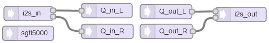

[Back to Teensy](./teensy.md)

---

# Creating Custom Audio Objects with AudioRecordQueue and AudioPlayQueue

When connecting blocks from the audio library, audio is streamed as packets of data between teensy audio objects. This works nicely, but when creating custom objects it is required to dig a little deeper. This can be achieved with the `AudioRecordQueue` and `AudioPlayQueue` classes which act as interfaces to memory and functions outside the Teensy audio system.

## Behind the Scenes

- [PJRC: Audio Connections & Memory](https://www.pjrc.com/teensy/td_libs_AudioConnection.html) describes the `AudioConnection` class used for "Patchcords" between audio objects.
- [PJRC Forum, "Accessing 128 bit sample packets"](https://forum.pjrc.com/index.php?threads/accessing-128-bit-sample-packets.59171/) explains the queue system with a simple example.


The TeensyDuino audio library is hard-coded for 16-bit, 44.1kHz sample rate, with a 128-sample buffer (2.9 ms latency). The USB connection is hard-coded for stereo. During compilation, the Arduino IDE needs to be set to `Tools -> USB Type -> Audio`. See also https://www.pjrc.com/teensy/td_libs_Audio.html

The audio buffer size for all audio connections needs to be set with `AudioMemory(numberBlocks)` during `setup()` where `numberBlocks` is the number of 128 sample blocks, for a start a value of 10 (29 ms) is fine. Higher numbers reserve more memory that might be needed otherwise, lower numbers might cause "hiccups" due to buffer underflows. For debugging, use the function `AudioMemoryUsageMax()`. See the discussion [AudioMemory() - what parameter should I pass?](https://forum.pjrc.com/index.php?threads/audiomemory-what-parameter-should-i-pass.39245/). See the example [teensy_usb_audio_fir_filter.md](./teensy_usb_audio_fir_filter.md) for an example how to use these functions.

The roundtrip latency is higher than that, probably due to additional buffering by the operating system.

## Teensy GUI



## Code

The code is taken from the discussion [PJRC Forum, "Accessing 128 bit sample packets"](https://forum.pjrc.com/index.php?threads/accessing-128-bit-sample-packets.59171/).


```CPP
// Simple demo of the use of record and play queues
// If a button is pressed, switch the L and R channels
// of the audio. Otherwise, play straight through.
// By Pete El_Supremo 200119

#include <Audio.h>
#include <Wire.h>
#include <SPI.h>
#include <SD.h>
#include <SerialFlash.h>

// uncomment to test that audio is playing
//#define STRAIGHT_THRU
#ifdef STRAIGHT_THRU
AudioInputI2S            i2s_in;
AudioOutputI2S           i2s_out;
AudioConnection          patchCord1(i2s_in, 0, i2s_out, 0);
AudioConnection          patchCord2(i2s_in, 1, i2s_out, 1);
AudioControlSGTL5000     sgtl5000;
#else
// GUItool: begin automatically generated code
AudioInputI2S            i2s_in;         //xy=389,265
AudioRecordQueue         Q_in_L;         //xy=548,259
AudioRecordQueue         Q_in_R;         //xy=549,302
AudioPlayQueue           Q_out_L;        //xy=668,261
AudioPlayQueue           Q_out_R;        //xy=669,302
AudioOutputI2S           i2s_out;        //xy=820,267
AudioConnection          patchCord1(i2s_in, 0, Q_in_L, 0);
AudioConnection          patchCord2(i2s_in, 1, Q_in_R, 0);
AudioConnection          patchCord3(Q_out_L, 0, i2s_out, 0);
AudioConnection          patchCord4(Q_out_R, 0, i2s_out, 1);
AudioControlSGTL5000     sgtl5000;       //xy=388,306
// GUItool: end automatically generated code
#endif

//const int myInput = AUDIO_INPUT_MIC;  // select MIC input
const int myInput = AUDIO_INPUT_LINEIN;  // select LINEIN

short buf_L[AUDIO_BLOCK_SAMPLES];  // AUDIO_BLOCK_SAMPLES = 128, samples 
short buf_R[AUDIO_BLOCK_SAMPLES];  // per packet, defined in Audio library

#define SWITCH_PIN 0  // Pin 0 for switch

// debounce the button
#include <Bounce.h>
Bounce bouncer = Bounce( SWITCH_PIN,5 );

void setup(void)
{
  pinMode(SWITCH_PIN, INPUT_PULLUP);  // enable pullup resistor for switch
  AudioMemory(10);  // reserve memory for 10 packets

  // Enable the audio shield, select input and enable output
  sgtl5000.enable();
  sgtl5000.inputSelect(myInput);
  sgtl5000.volume(0.5);
#ifndef STRAIGHT_THRU
  // Start the record queues
  Q_in_L.begin();  // start capturing audio, readBuffer() / freeBuffer() or
  Q_in_R.begin();  // clear() must be called frequently to avoid queue overflow
#endif
}

void loop(void)
{
#ifndef STRAIGHT_THRU
  // declare two uninitialized pointers (wild pointers) to short (int16) type
  // of data, i.e. to some random memory address. Is this good C++?
  short *bp_L, *bp_R;   
                        
// Update the debouncer
  bouncer.update();

// available() returns number of available audio packets. When at least one left
// and right input buffer packet is available, process both. 
// readBuffer() returns a pointer to an AUDIO_BLOCK_SAMPLES (128) sample array
// of in16:
  if (Q_in_L.available() >= 1 && Q_in_R.available() >= 1) {
    bp_L = Q_in_L.readBuffer();
    bp_R = Q_in_R.readBuffer();
    // Copy the audio buffers sample by sample to our local memory:
    for(int i = 0; i < AUDIO_BLOCK_SAMPLES; i++) {
      buf_L[i] = bp_L[i];
      buf_R[i] = bp_R[i];
    }
    Q_in_L.freeBuffer();  // release the memory from the previously
    Q_in_R.freeBuffer();  // read packet returned from readBuffer()
    // Read only a single packet, memory must be freed with freeBuffer()

    // Normally, you would now do fancy stuff to the buffers buf_L/R[i]
    // But in this example there is nothing to do.

    if(bouncer.read()) {
      bp_L = Q_out_L.getBuffer();  // return pointer to undefined array of
      bp_R = Q_out_R.getBuffer();  // AUDIO_BLOCK_SAMPLES (128) of short
    } else {
      // Same as above but switch L and R channel
      bp_L = Q_out_R.getBuffer();
      bp_R = Q_out_L.getBuffer();
    }

    // copy the (un)processed data back to the output
    for(int i = 0; i < AUDIO_BLOCK_SAMPLES; i++) {
      bp_L[i] = buf_L[i];
      bp_R[i] = buf_R[i];
    }

    // and play them back into the audio queues
    Q_out_L.playBuffer();
    Q_out_R.playBuffer();
  }
#endif
}
```

---

[Back to Teensy](./teensy.md)