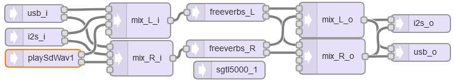

[Back to Teensy](./teensy.md)

---

# Playing a sound file from SD card with reverb

This example shows how to play an audio file from the SD card on the Teensy audio shield, mix it with analog and USB input and send it through a stereo reverb. The output is written to the analog and USB audio output. The SD card communicates via the SPI bus, this should be independent from the USB port and the CODEC (I2S bus).

## SD Card

Only WAV files with 44.1 kHz and 16 bits in mono or stereo are supported. Mono files are played to both L and R channel.

If unsure about SD card performance, run the example under `File > Examples > Audio > HardwareTesting > SdCardTest`.

## RAM and Processor Utilization

Reverb effects can be quite heavy on memory and CPU utilization, the following functions help to monitor resource utilization.

### Memory

The following functions return the number of memory blocks (128 x 2 x 16 bit) used by the audio library.

- `AudioMemoryUsage();`: Returns the number of blocks currently in use.
- `AudioMemoryUsageMax();` : Return the maximum number of blocks that have ever been used. This is by far the most useful function for monitoring memory usage.
- `AudioMemoryUsageMaxReset();` : Reset the maximum reported by `AudioMemoryUsageMax()`.

### Processor

All of the following functions return the processor usage as a number between 0 and 100, representing an estimate of the percentage of the total CPU time consumed.

- `AudioProcessorUsage();` :  Returns an estimate of the total CPU time used during the most recent audio library update.
- `AudioProcessorUsageMax();` : Return an estimate of the maximum percentage of CPU time any audio update has ever used. This function is the most useful for assuring the audio processing is operating within acceptable limits. 
- `AudioProcessorUsageMaxReset();` : Reset the maximum reported by `AudioProcessorUsageMax()`.

Processor usage can also be reported per object using `anyObject.AudioProcessorUsage();`, `anyObject.AudioProcessorUsageMax();` and `anyObject.processorUsageMaxReset(); `.

## Teensy GUI



## Code

In the `setup()` part, the codec and serial communication for debugging are initialized as well as the other components.

In the `loop()` part, the analog input at pin 15 is read every 100 ms. Its value is scaled from 0 ... 1023 to 0 ... 0.8 and used to control the damping of the reverb.

```C
#include <Audio.h>
#include <Wire.h>
#include <SPI.h>
#include <SD.h>
#include <SerialFlash.h>

// GUItool: begin automatically generated code
AudioInputUSB            usb_i;             //xy=306,585
AudioInputI2S            i2s_i;             //xy=307,625
AudioPlaySdWav           playSdWav1;        //xy=321,661
AudioMixer4              mix_L_i;           //xy=483,597
AudioMixer4              mix_R_i;           //xy=486,661
AudioEffectFreeverbStereo freeverbs_L;      //xy=629,583
AudioEffectFreeverbStereo freeverbs_R;      //xy=629,645
AudioMixer4              mix_L_o;           //xy=806,596
AudioMixer4              mix_R_o;           //xy=807,658
AudioOutputI2S           i2s_o;             //xy=956,602
AudioOutputUSB           usb_o;             //xy=956,651

AudioConnection          patchCord1(usb_i, 0, mix_L_i, 0);
AudioConnection          patchCord2(usb_i, 1, mix_R_i, 0);
AudioConnection          patchCord3(i2s_i, 0, mix_L_i, 1);
AudioConnection          patchCord4(i2s_i, 1, mix_R_i, 1);
AudioConnection          patchCord5(playSdWav1, 0, mix_L_i, 2);
AudioConnection          patchCord6(playSdWav1, 1, mix_R_i, 2);
AudioConnection          patchCord7(mix_L_i, freeverbs_L);
AudioConnection          patchCord8(mix_R_i, freeverbs_R);
AudioConnection          patchCord9(freeverbs_L, 0, mix_L_o, 0);
AudioConnection          patchCord10(freeverbs_L, 1, mix_R_o, 0);
AudioConnection          patchCord11(freeverbs_R, 0, mix_L_o, 1);
AudioConnection          patchCord12(freeverbs_R, 1, mix_R_o, 1);
AudioConnection          patchCord13(mix_L_o, 0, i2s_o, 0);
AudioConnection          patchCord14(mix_L_o, 0, usb_o, 0);
AudioConnection          patchCord15(mix_R_o, 0, i2s_o, 1);
AudioConnection          patchCord16(mix_R_o, 0, usb_o, 1);

AudioControlSGTL5000     sgtl5000_1;     //xy=634,681
// GUItool: end automatically generated code

const long interval_damping = 100;  // interval to set damping
const long interval_monitor = 200;   // interval to print resources
elapsedMillis delta_ms_damp = 0;  // global variable
elapsedMillis delta_ms_mon = 0;  // global variable


void setup() {
Serial.begin(9600);
AudioMemory(10);
sgtl5000_1.enable();
sgtl5000_1.volume(0.5);
sgtl5000_1.inputSelect(AUDIO_INPUT_LINEIN);

mix_L_i.gain(0, 0.5);
mix_L_i.gain(1, 0.5);
mix_L_i.gain(2, 0.5);
mix_R_i.gain(0, 0.5);
mix_R_i.gain(1, 0.5);
mix_R_i.gain(2, 0.5);

mix_L_o.gain(0, 0.5);
mix_L_o.gain(1, 0.5);
mix_R_o.gain(0, 0.5);
mix_R_o.gain(1, 0.5);

freeverbs_L.roomsize(0.2); // 0 is smallest, 1.0 is largest roomsize
freeverbs_R.roomsize(0.2);
freeverbs_L.damping(0.5); // 0 is lowest damping (hard surfaces)
freeverbs_R.damping(0.5); // 1 is largest damping (soft surfaces)

playSdWav1.play("file1.wav");
// reading and parsing the header of the wav file takes a small time,
// during this time playSdWav1.isplaying() is False
delay(50); 
}

void loop() {
  if (delta_ms_damp >= interval_damping)
  {
    float damping = analogRead(15) / 1300.0; // scale to roughly 0 ... 0.8
    freeverbs_L.damping(damping); 
    freeverbs_R.damping(damping);

    // if file has finished, start again
    if (!playSdWav1.isPlaying()){
        playSdWav1.play("file1.wav");
        }

    delta_ms_damp = 0;
  }
  if (delta_ms_mon >= interval_monitor)
  {
    Serial.print("Mem Max = ");
    Serial.print(AudioMemoryUsageMax());
    Serial.print(" CPU Max = ");
    Serial.println(AudioProcessorUsageMax());

    delta_ms_mon = 0;
  }
}
```

## Experiment

Connect an analog source to the line input (if you don't have an analog source, replace it by an USB audio source.)

### Further experiments

Try to create a "robotic voice" by modulating the audio signal with a low-frequency (around 100 Hz) sinusoidal signal.

---

[Back to Teensy](./teensy.md)