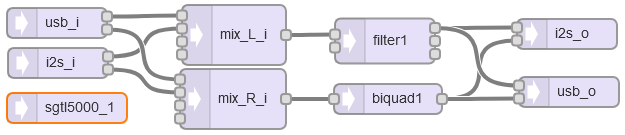

[Back to Teensy](./teensy.md)

---

# FFT Analysis of an Audio Stream with Teensy

In this example an audio stream with sample rate of 44.1 kHz is analysed with a 1024 point FFT, the first 25 bins (0 ... 1.1 kHz) are printed to the serial monitor. This based on the example `File -> Examples -> Audio -> ...`. Additionally, the maximum value, its index and the corresponding frequency is printed.

See also "FFT on the Teensy with [Hackster.io Teensy Audio"](https://youtu.be/S8A7ZuupS_M)

## Teensy GUI



## Code

The code uses the methods `myfft.read(bin)` resp. `myfft.read(bin1, bin2)` which yield ...

The `assert()` statement 'enforces the contract', i.e. that a valid array with at least one member is passed to the max function.

The `for` loop can start with the second element of the array, because `maxValue`is already initialized with the first element.

Except for the `setup()` and `loop()` statements, the code has been generated by and exported from the Teensy Audio System Design Tool.

```C
#include <Audio.h>
#include <Wire.h>
#include <SPI.h>
#include <SD.h>
#include <SerialFlash.h>

// GUItool: begin automatically generated code
AudioSynthWaveformSine   sine1;          //xy=402,1164
AudioInputUSB            usb_i;          //xy=403,1199
AudioMixer4              mixer1;         //xy=551,1183
AudioFilterBiquad        biquad1;        //xy=709,1183
AudioAnalyzeFFT1024      fft1024_1;      //xy=714,1222
AudioOutputUSB           usb_o;          //xy=861,1184

AudioConnection          patchCord1(sine1, 0, mixer1, 0);
AudioConnection          patchCord2(usb_i, 0, mixer1, 1);
AudioConnection          patchCord3(usb_i, 1, mixer1, 2);
AudioConnection          patchCord4(mixer1, biquad1);
AudioConnection          patchCord5(mixer1, fft1024_1);
AudioConnection          patchCord6(biquad1, 0, usb_o, 0);
AudioConnection          patchCord7(biquad1, 0, usb_o, 1);
// GUItool: end automatically generated code


const float noteFrequency[12] = {
  220.00,  // A3
  233.08,  // A#3
  246.94,  // B3
  261.63,  // C4
  277.18,  // C#4
  293.66,  // D4
  311.13,  // D#4
  329.63,  // E4
  349.23,  // F4
  369.99,  // F#4
  392.00,  // G4
  415.30   // G#4
};

void setup() {
Serial.begin(9600);
delay(300);
sine1.frequency(500);
sine1.amplitude(0.7);
mixer1.gain(0, 0.7);
mixer1.gain(1, 0.7);
mixer1.gain(2, 0.7);
biquad1.setNotch(0, 300);

AudioMemory(8);  // allocate buffer memory for audio streams

// Initialize the system
Serial.println("setup done");
}
unsigned long last_time = millis();

void loop()
{
// print Fourier Transform data to the Arduino Serial Monitor
  if (fft1024_1.available()) {
    
    Serial.print("FFT: ");
    for (int i=0; i<30; i++) {  // 0-25  -->  DC to 1.25 kHz
      float n = fft1024_1.read(i);
      printNumber(n);
    }
    Serial.println();
  }
  
// print information about processor and memory usage every 2500 ms
if (millis() - last_time >= 2500) {
    Serial.print("Proc = ");
    Serial.print(AudioProcessorUsage());  // usage in percent
    Serial.print(" (");    
    Serial.print(AudioProcessorUsageMax());  // max. processor usage
    Serial.print("),  Mem = ");
    Serial.print(AudioMemoryUsage());  // memory usage in blocks
    Serial.print(" (");    
    Serial.print(AudioMemoryUsageMax()); // max. memory usage in blocks
    Serial.println(")");
    last_time = millis();  // update time variable
    }

/*
  if (fft1024_1.available()) {
    // each time new FFT data is available
    // print to the Arduino Serial Monitor
    Serial.print("FFT: ");
    printNumber(fft1024_1.read(0));
    printNumber(fft1024_1.read(1));
    printNumber(fft1024_1.read(2,3));
    printNumber(fft1024_1.read(4,6));
    printNumber(fft1024_1.read(7,10));
    printNumber(fft1024_1.read(11,15));
    printNumber(fft1024_1.read(16,22));
    printNumber(fft1024_1.read(23,32));
    printNumber(fft1024_1.read(33,46));
    printNumber(fft1024_1.read(47,66));
    printNumber(fft1024_1.read(67,93));
    printNumber(fft1024_1.read(94,131));
    printNumber(fft1024_1.read(132,184));
    printNumber(fft1024_1.read(185,257));
    printNumber(fft1024_1.read(258,359));
    printNumber(fft1024_1.read(360,511));
    Serial.println();
  }
*/

}

void printNumber(float n) {
  
  if (n >= 0.004) {
    Serial.print(n, 3);
    Serial.print(" ");
  } else {
    Serial.print("   -  "); // don't print "0.00"
  }
  
  /*
  if (n > 0.25) {
    Serial.print("***** ");
  } else if (n > 0.18) {
    Serial.print(" ***  ");
  } else if (n > 0.06) {
    Serial.print("  *   ");
  } else if (n > 0.005) {
    Serial.print("  .   ");
  }
  */
}


/*
#include<assert.h>
#include<stdio.h>
#include<stdlib.h>
#include<time.h>

int
maxValue(int myArray[], size_t size) {
    assert(myArray && size);
    size_t i;
    int maxValue = myArray[0];

    for (i = 1; i < size; ++i) {
        if ( myArray[i] > maxValue ) {
            maxValue = myArray[i];
        }
    }
    return maxValue;
}

int
main(void) {
    int i;
    int x[] = {1, 2, 3, 4, 5};
    int *y = malloc(10 * sizeof(*y));

    srand(time(NULL));

    for (i = 0; i < 10; ++i) {
        y[i] = rand();
    }

    printf("Max of x is %d\n", maxValue(x, sizeof(x)/sizeof(x[0])));
    printf("Max of y is %d\n", maxValue(y, 10));

    return 0;
}
*/

```

## Measurement

Generate an audio signal with 44100 Hz sampling frequency, overlayed with a sine or a chirp signal and feed it into the Teensy.

## Further experiments / ideas

---

[Back to Teensy](./teensy.md)