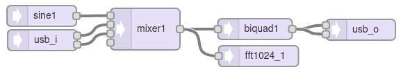

[Back to Teensy](./teensy.md)

---

# FFT Analysis of an Audio Stream with Teensy

In this example an audio stream with sample rate of 44.1 kHz is analysed with a 1024 point FFT, the first 25 bins (0 ... 1.1 kHz) are printed to the serial monitor. This based on the example `File -> Examples -> Audio -> ...`. Additionally, the maximum value, its index and the corresponding frequency is printed.

See also "FFT on the Teensy with [Hackster.io Teensy Audio"](https://youtu.be/S8A7ZuupS_M)

## Teensy GUI



## Code

### Class AudioAnalyzeFFT1024

The class `AudioAnalyzeFFT1024` supports the following methods and objects (instantiated as `fft1024` here):

- `fft1024.available()` returns `True` every time the FFT has produced new data (approx. 86 times per second).

- `fft1024.read(bin)` returns the magnitude of the corresponding bin (0 ... 511) as a float where a sine input with amplitude 1.0 and a suitable frequency yields an output of 0.5 (double-sideband scaling). `fft1024.read(firstBin, lastBin)` returns the sum of the specified bins. The higher audio octaves contain many bins, which can be read as a group for audio visualization.

- The array `fft1024.output` contains the 512 raw (unscaled) `uint16_t` output bins. For some reason, `read(bin) = output[bin] / (1024 * 16)`.

- The window is set with `fft1024.windowFunction(window)` where the default window function is `AudioWindowHanning1024` (i.e. a Hann window). `fft1024.windowFunction(NULL)` yields rectangular windowing.

The name of the `AudioAnalyzeFFT256` methods comply to a similar scheme.

### Library teensy_lib

Functions are stored in a separate library in order to keep the main file short. To create header and library files `teensy_lib.h` and `teensy_lib.cpp`, you need to open a new tab in the Arduino IDE ('...' on the right hand side) and create the files. Or you simply copy the files into the sketch directory and restart the IDE.

#### teensy_lib.h

```C
#ifndef TEENSY_LIB_H
#define TEENSY_LIB_H

void findMax(uint16_t myArray[], int size, uint16_t &max_idx, uint16_t &max_value);

void printNumber(float n);
void printNumberInt(int n);

#endif //TEENSY_LIB_H
```

#### teensy_lib.cpp

```C
#include <Arduino.h> //needed for Serial.println()
#include<assert.h>
#include<stdio.h>
#include<stdlib.h>

const float noteFrequency[12] = {
  220.00,  // A3
  233.08,  // A#3
  246.94,  // B3
  261.63,  // C4
  277.18,  // C#4
  293.66,  // D4
  311.13,  // D#4
  329.63,  // E4
  349.23,  // F4
  369.99,  // F#4
  392.00,  // G4
  415.30   // G#4
};

void findMax(uint16_t myArray[], int size, uint16_t &max_idx, uint16_t &max_value) {
    /* search for array index of maximum element. Return the index in max_idx and the value in
       max_value, both variables are passed by reference.
     */
    assert(myArray && size);
    size_t i;
    max_value = myArray[0];
    max_idx = 0;

    for (i = 1; i < size; ++i) {
        if ( myArray[i] > max_value ) {
            max_value = myArray[i];
            max_idx = i;
        }
    }
}

void printNumber(float n) {
  
  if (n >= 0.004) {
    Serial.print(n, 3); // three fractional places
    Serial.print(" ");
  } else {
    Serial.print("   -  "); // don't print "0.00"
  }
}
```

`void findMax(uint16_t myArray[], int size, uint16_t &max_idx, uint16_t &max_value)` finds the maximum value in `myArray[]` with size `size` and returns it as `max_value` at index `max_idx`. Both variables are passed as references.

The `assert()` statement 'enforces the contract', i.e. that a valid array with at least one member is passed to the max function.

The `for` loop starts with the second element of the array, because `max_value` is already initialized with the first element.

```C
#include <Audio.h>  //  includes from library
#include <Wire.h>
#include <SPI.h>
#include <SD.h>
#include <SerialFlash.h>
#include "teensy_lib.h"  // includes from sketch folder

// GUItool: begin automatically generated code
AudioSynthWaveformSine   sine1;          //xy=402,1164
AudioInputUSB            usb_i;          //xy=403,1199
AudioMixer4              mixer1;         //xy=551,1183
AudioFilterBiquad        biquad1;        //xy=709,1183
AudioAnalyzeFFT1024      fft1024;        //xy=714,1222
AudioOutputUSB           usb_o;          //xy=861,1184

AudioConnection          patchCord1(sine1, 0, mixer1, 0);
AudioConnection          patchCord2(usb_i, 0, mixer1, 1);
AudioConnection          patchCord3(usb_i, 1, mixer1, 2);
AudioConnection          patchCord4(mixer1, biquad1);
AudioConnection          patchCord5(mixer1, fft1024);
AudioConnection          patchCord6(biquad1, 0, usb_o, 0);
AudioConnection          patchCord7(biquad1, 0, usb_o, 1);
// GUItool: end automatically generated code

void setup() {
Serial.begin(9600);
delay(300);
sine1.frequency(16 * 44100 / 1024);
sine1.amplitude(0.5);
mixer1.gain(0, 1.0);
mixer1.gain(1, 0.7);
mixer1.gain(2, 0.7);
biquad1.setNotch(0, 300);
// fft1024.windowFunction(NULL);  // set rect window

AudioMemory(8);  // allocate buffer memory for audio streams

// Initialize the system
Serial.println("setup done");
}
unsigned long last_time_perf = millis();
uint16_t max_idx, max_value;

void loop()
{
// print Fourier Transform data to the Arduino Serial Monitor
// when new data becomes available
  if (fft1024.available()) {
    
    Serial.print("FFT: ");
    for (int i=0; i<30; i++) {  // 0-25  -->  DC to 1.25 kHz
      float S_i = fft1024.read(i);  // scaled, float FFT
      printNumber(S_i);
      // uint16_t n_raw = fft1024.output[i];  // raw, unscaled FFT
      // printNumberInt((int)n_raw); // type cast from uint16_t to int
    }

    findMax(fft1024.output, 512, max_idx, max_value);
    Serial.print("Max = " );
    Serial.print(max_value);
    Serial.print(" @ ");
    Serial.print(max_idx);
    Serial.print(" = ");
    Serial.print((float)max_idx * 44100.0 / 1024.0);
    Serial.println(" Hz");

    float freq = 100.0 + (float)analogRead(15); // scale from 100 ... 1123 
    sine1.frequency(freq);
  }
  
// print information about processor and memory usage every 2500 ms
if (millis() - last_time_perf >= 2500) {
    Serial.print("Proc = ");
    Serial.print(AudioProcessorUsage());  // usage in percent
    Serial.print(" (");    
    Serial.print(AudioProcessorUsageMax());  // max. processor usage
    Serial.print("),  Mem = ");
    Serial.print(AudioMemoryUsage());  // memory usage in blocks
    Serial.print(" (");    
    Serial.print(AudioMemoryUsageMax()); // max. memory usage in blocks
    Serial.println(")");
    last_time_perf = millis();  // update time variable
    }
}

```

## Measurement

Generate an audio signal with 44100 Hz sampling frequency, overlayed with a sine or a chirp signal and feed it into the Teensy.

A sine source is added on the Teensy, its frequency can be set with the potentiometer. The FFT of the mixed signals is calculated and printed to the serial monitor. The notch frequency of the filter is set according to the maximum of the FFT.

## Further experiments / ideas

---

[Back to Teensy](./teensy.md)