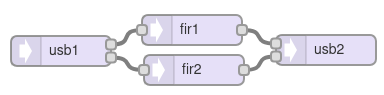

[Back to Teensy](./teensy.md)

<hr>

# USB Audio FIR Filtering with Teensy

This is a stripped down version of the `File -> Examples -> Audio -> Effects -> Filter_FIR`, using its coefficient files.

## Teensy GUI



## Code

Except for the `setup()` and `loop()` statements, the code has been generated by and exported from the Teensy Audio System Design Tool.

```C
#include <Audio.h>
#include <Wire.h>
#include "filters.h"

// GUItool: begin automatically generated code
AudioInputUSB            usb1;
AudioFilterFIR           fir1;           // left channel
AudioFilterFIR           fir2;           // right channel 
AudioOutputUSB           usb2;

AudioConnection          patchCord1(usb1, 0, fir1, 0);
AudioConnection          patchCord2(usb1, 1, fir2, 0);
AudioConnection          patchCord3(fir1, 0, usb2, 0);
AudioConnection          patchCord4(fir2, 0, usb2, 1);
// GUItool: end automatically generated code

struct fir_filter {
short *coeffs;       // coefficients need to be 16 bit integers
short num_coeffs;    // num_coeffs must be an even number, 4 or higher
};

int fir_idx = 0; // index of current filter
struct fir_filter fir_list[] = {
{low_pass , 100},    // low pass with cutoff at 1kHz and -60dB at 2kHz
{band_pass, 100},    // bandpass 1200Hz - 1700Hz
{NULL,      0}       // disabled
};


void setup() {
Serial.begin(9600);
delay(300);

AudioMemory(8);  // allocate buffer memory for audio streams

// Initialize the filter with low_pass coefficients
fir1.begin(fir_list[fir_idx].coeffs, fir_list[fir_idx].num_coeffs);
fir2.begin(fir_list[2].coeffs, fir_list[2].num_coeffs);
Serial.println("setup done");
}

unsigned long last_time = millis();

void loop()
{
// print information about processor and memory usage every 2500 ms
if (millis() - last_time >= 2500) {
    Serial.print("Proc = ");
    Serial.print(AudioProcessorUsage());  // usage in percent
    Serial.print(" (");    
    Serial.print(AudioProcessorUsageMax());  // max. processor usage
    Serial.print("),  Mem = ");
    Serial.print(AudioMemoryUsage());  // memory usage in blocks
    Serial.print(" (");    
    Serial.print(AudioMemoryUsageMax()); // max. memory usage in blocks
    Serial.println(")");
    last_time = millis();  // update time variable
    }
}
```

The filter coefficients are imported via `filters.h`

```C
// filters.h
#define NUM_COEFFS 100  // Number of coefficients
extern short low_pass[];
extern short band_pass[];
```

and `filters.cpp`

```C
// filters.cpp
#include "filters.h"
short low_pass[NUM_COEFFS] = {
#include "lopass_1000_44100.h"
};

short band_pass[NUM_COEFFS] = {
#include "bandp_1200_1700.h"
};
```

which imports the coefficients for a 100 tap FIR lowpass filter with a passband 0 ... 1000 Hz and a stopband 2000 ... 22050 Hz (f_S/2)

```C
// lopass_1000_44100.h
(short)0x0015,
(short)0x0011,
(short)0x0017,
(short)0x001E,
(short)0x0025,
(short)0x002C,
(short)0x0032,
(short)0x0037,
...
```

<hr>

[Back to Teensy](./teensy.md)