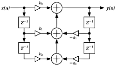

[Back to Teensy](./teensy.md)

---

# USB Audio IIR Filtering with Teensy

This is a stripped down version of the example `File -> Examples -> Audio -> Effects -> Filter`, using its coefficient files.

An audio signal is fed into the Teensy via its USB audio input, both channels are filtered with IIR filters and streamed to the USB output. 

## Biquad Filter

IIR filters are often constructed from cascaded biquadratic (biquad) or second-order filter section, each with one or two poles and zeros. Splitting a higher order filter / polynome into second-order sections tremendously increases the robustness against coefficient and arithmetic quantization errors. Especially the so-called [direct-form 1 (DF1)](https://ccrma.stanford.edu/~jos/fp/Direct_Form_I.html) topology shown in the following image



is quite robust against internal overflows (only one summation node, two-pole filter section follows two-zero section). THe filter topology is called "direct" because it *directly* implements the difference equation 
$y[n] = b_0  x[n] + b_1  x[n-1] + b_2  x[n-2] - a_1  y[n-1] - a_2  y[n-2]$, yielding the system function

$$
H(z) = \frac{b_0 + b_1  z^{-1} + b_2 z^{-2} }{1 + a_1  z^{-1} + a_2 z^{-2} }.
$$

The widely used CMSIS (Common Microcontroller Software Interface Standard) DSP library uses this sign convention.

Python Scipy / Matlab filter design routines deliver and expect recursive coefficients with opposite sign.

This topology (with CMSIS sign convention) is also used in the Teensy Audio block "Biquad" which implements an IIR filter made of 1 ... 4 cascaded biquad sections, giving a total filter order of up to $N = 8$. The resulting slope between pass and stop band is $N \cdot 20$ dB/dec or $N \cdot 6$ dB/oct.

The filter stages can be configured by using `setLowpass(stage, frequency, Q)`, `setHighpass()`, `setBandpass()` or `setNotch()` where `stage = 0 ... 3` selects the number of the stage, frequency is the corner frequency in Hz and `Q` is a quality factor. For low- and highpass filter this creates resonant peaking for Q > 0.707 which may cause clipping of the signal. For bandpass and notch filter, Q controls the width of passband resp. notch.

Creating a higher order filter with a defined pass and stop-band behaviour this way is quite difficult, probably it is easier to use a filter design tool like pyfda and export the coefficients. These coefficients can be used with `setCoefficients(stage, array[5])`

Configure one stage of the filter (0 to 3) with an arbitrary filter response. The array of coefficients is in order: `b0, b1, b2, a1, a2`. Each coefficient must be $-2.0 < c < 2.0 $ and should be of type 'double'. Alternatively, it may be of type 'int', where 1.0 is represented by $2^{30} = 1073741824$.

[Direct-form 2 (DF2)](https://ccrma.stanford.edu/~jos/filters/Direct_Form_II.html) is another filter topology, See Discussions on 
[IIR Direct Form II Filter Implementation on T eensy 4.0](https://forum.pjrc.com/index.php?threads/iir-direct-form-ii-filter-implementation-on-teensy-4-0.69123/).

Filters with low corner frequencies ($f_c < 400$ Hz for sampling frequency $f_S = 44.1$ kHz or normalized $F_c < 0.01$ Hz) tend to become unstable as the very small coefficients introduce large numerical errors.

The coefficients in the example below have been generated with pyfda for a notch filter with 

## State-Variable (Chamberlin) Filter

This is a second order filter with a rolloff of 20 dB/dec. or 12 dB/oct., it is numerically more robust than the biquad filter described above. Filter stages can be cascaded in order to achieve higher filter orders.

This filter is derived from a state-space description of the discrete-time system, it allows controlling the corner frequency in real time via the frequency control input which expects values in the range $-1.0 ... +1.0$. `octaveControl(octaves)` determines how many octaves a full scale input modulates the corner frequency. `frequency(f)` sets the corner frequency in Hz when the control input is 0. The combination of those parameters controls $K$ in the figure below.

The amount of peaking ("Q") can be set with `resonance(Q)` ($0.7 \le Q \le 5.0$) independently and in real-time. Low-pass, high-pass and band-pass output are available at the same time. These features make state-variable filters very attractive for music electronic applications where corner frequency and resonance are modulated to create rich sounds.


## Teensy GUI


## Code

Except for the `setup()` and `loop()` statements, the code has been generated by and exported from the Teensy Audio System Design Tool.

```C
#include <Audio.h>
#include <Wire.h>
#include <SPI.h>
#include <SD.h>
#include <SerialFlash.h>

// GUItool: begin automatically generated code
AudioInputUSB            usb_i;          //xy=417,1233
AudioFilterBiquad        biquad;        //xy=588,1281
AudioFilterStateVariable state_variable1;        //xy=591,1233
AudioOutputUSB           usb_o;          //xy=772,1227

AudioConnection          patchCord1(usb_i, 0, state_variable1, 0);
AudioConnection          patchCord2(usb_i, 1, biquad, 0);
AudioConnection          patchCord3(biquad, 0, usb_o, 1);
AudioConnection          patchCord4(state_variable1, 0, usb_o, 0);

// GUItool: end automatically generated code


double coeffs_notch[5] = {
    0.43393598816657514,
    -2.03415958401572e-07,
    0.4339359881665751,
    2.0341595841077975e-07,
    0.13212802366684975
};

void setup() {
Serial.begin(9600);
delay(300);

AudioMemory(8);  // allocate buffer memory for audio streams

// Initialize the system
//sine1.frequency(0.5);
//sine1.amplitude(0.9);
state_variable1.frequency(500.0);
state_variable1.resonance(1.0);
// state_variable.octaveControl(1.0);
biquad.setCoefficients(0, coeffs_notch);
Serial.println("setup done");
}

unsigned long last_time = millis();

void loop()
{
// print information about processor and memory usage every 2500 ms
if (millis() - last_time >= 2500) {
    Serial.print("Proc = ");
    Serial.print(AudioProcessorUsage());  // usage in percent
    Serial.print(" (");    
    Serial.print(AudioProcessorUsageMax());  // max. processor usage
    Serial.print("),  Mem = ");
    Serial.print(AudioMemoryUsage());  // memory usage in blocks
    Serial.print(" (");    
    Serial.print(AudioMemoryUsageMax()); // max. memory usage in blocks
    Serial.println(")");
    last_time = millis();  // update time variable
    }
}
```

## Measurement

Generate a stereo track with 44100 Hz sampling frequency and e.g. 5 s of white noise or a chirp signal. Record the filtered signal.

The recorded signal can be displayed as a time signal, analyzed as a periodogram (Analyze -> Plot Spectrum) or displayed as spectrogram (left panel, right mouse button -> Spectrogram).

## Further experiments / ideas

---

[Back to Teensy](./teensy.md)