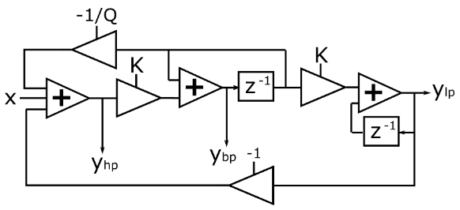

[Back to Teensy](./teensy.md)

---

# USB Audio IIR Filtering with Teensy

This is a stripped down version of the example `File -> Examples -> Audio -> Effects -> Filter`, using its coefficient files.

An audio signal is fed into the Teensy via its USB audio input, both channels are filtered with IIR filters and streamed to the USB output. 

## Biquad Filter

IIR filters are often constructed from cascaded biquadratic (biquad) or second-order filter section, each with one or two poles and zeros. Splitting a higher order filter / polynome into second-order sections tremendously increases the robustness against coefficient and arithmetic quantization errors. Especially the so-called [direct-form 1 (DF1)](https://ccrma.stanford.edu/~jos/fp/Direct_Form_I.html) topology shown in the following image


is quite robust against internal overflows (only one summation node, two-pole filter section follows two-zero section). THe filter topology is called "direct" because it *directly* implements the difference equation $h[n]$.

This topology is also used in the Teensy Audio block "Biquad" which implements an IIR filter made of 1 ... 4 cascaded biquad sections, giving a total filter order of up to $N = 8$. The resulting slope between pass and stop band is $N \cdot 20$ dB/dec or $N \cdot 6$ dB/oct.

The filter stages can be configured by using `setLowpass(stage, frequency, Q)`, `setHighpass()`, `setBandpass()` or `setNotch()` where `stage = 0 ... 3` selects the number of the stage, frequency is the corner frequency in Hz and `Q` is a quality factor. For low- and highpass filter this creates resonant peaking for Q > 0.707 which may cause clipping of the signal. For bandpass and notch filter, Q controls the width of passband resp. notch.

Creating a higher order filter with a defined pass and stop-band behaviour this way is quite difficult, probably it is easier to use a filter design tool like pyfda and export the coefficients. These coefficients can be used with `setCoefficients(stage, array[5])`

Configure one stage of the filter (0 to 3) with an arbitrary filter response. The array of coefficients is in order: B0, B1, B2, A1, A2. Each coefficient must be less than 2.0 and greater than -2.0 and should be of type 'double'. Alternately, it may be type 'int', where 1.0 is represented by 1073741824 (2^30). 

[Direct-form 2 (DF2)](https://ccrma.stanford.edu/~jos/filters/Direct_Form_II.html) is another filter topology, See Discussions on 
[IIR Direct Form II Filter Implementation on T eensy 4.0](https://forum.pjrc.com/index.php?threads/iir-direct-form-ii-filter-implementation-on-teensy-4-0.69123/).

Filters with low corner frequencies ($f_c < 400$ Hz for sampling frequency $f_S = 44.1$ kHz or normalized $F_c < 0.01$ Hz) tend to become unstable as the very small coefficients introduce large numerical errors.

## State-Variable (Chamberlin) Filter

This is a second order filter with a rolloff of 20 dB/dec. or 12 dB/oct., it is numerically more robust than the biquad filter described above. Filter stages can be cascaded in order to achieve higher filter orders.

This kind of filter is derived from a state-space description of the discrete-time system, it allows setting the corner frequency and the amount of peaking ("Q") independently with a single parameter each. Additionally, low-pass, high-pass and band-pass output are available at the same time. These features make state-variable filters very attractive for music electronic applications where especially the corner frequency is modulated to create rich sounds.




## Teensy GUI


## Code

Except for the `setup()` and `loop()` statements, the code has been generated by and exported from the Teensy Audio System Design Tool.

```C
#include <Audio.h>
#include <Wire.h>
#include <SPI.h>
#include <SD.h>
#include <SerialFlash.h>

// GUItool: begin automatically generated code
AudioInputUSB            usb_i;           //xy=306,585
AudioInputI2S            i2s_i;           //xy=307,625
AudioMixer4              mix_R_i; //xy=482,661
AudioMixer4              mix_L_i; //xy=483,597
AudioFilterStateVariable filter1;        //xy=634,603
AudioFilterBiquad        biquad1;        //xy=637,661
AudioOutputI2S           i2s_o;           //xy=816,596
AudioOutputUSB           usb_o;           //xy=818,654

AudioConnection          patchCord1(usb_i, 0, mix_L_i, 0);
AudioConnection          patchCord2(usb_i, 1, mix_R_i, 0);
AudioConnection          patchCord3(i2s_i, 0, mix_L_i, 1);
AudioConnection          patchCord4(i2s_i, 1, mix_R_i, 1);
AudioConnection          patchCord5(mix_R_i, biquad1);
AudioConnection          patchCord6(mix_L_i, 0, filter1, 0);
AudioConnection          patchCord7(filter1, 0, i2s_o, 0);
AudioConnection          patchCord8(filter1, 0, usb_o, 0);
AudioConnection          patchCord9(biquad1, 0, i2s_o, 1);
AudioConnection          patchCord10(biquad1, 0, usb_o, 1);

AudioControlSGTL5000     sgtl5000_1;     //xy=316,670
// GUItool: end automatically generated code

void setup() {
Serial.begin(9600);
delay(300);

AudioMemory(8);  // allocate buffer memory for audio streams

// Initialize the filter with low_pass coefficients
fir1.begin(fir_list[fir_idx].coeffs, fir_list[fir_idx].num_coeffs);
fir2.begin(fir_list[2].coeffs, fir_list[2].num_coeffs);
Serial.println("setup done");
}

unsigned long last_time = millis();

void loop()
{
// print information about processor and memory usage every 2500 ms
if (millis() - last_time >= 2500) {
    Serial.print("Proc = ");
    Serial.print(AudioProcessorUsage());  // usage in percent
    Serial.print(" (");    
    Serial.print(AudioProcessorUsageMax());  // max. processor usage
    Serial.print("),  Mem = ");
    Serial.print(AudioMemoryUsage());  // memory usage in blocks
    Serial.print(" (");    
    Serial.print(AudioMemoryUsageMax()); // max. memory usage in blocks
    Serial.println(")");
    last_time = millis();  // update time variable
    }
}
```


## Measurement

Generate a stereo track with 44100 Hz sampling frequency and e.g. 5 s of white noise or a chirp signal.

The recorded signal can be displayed as a time signal, analyzed as a periodogram (Analyze -> Plot Spectrum) or displayed as spectrogram (left panel, right mouse button -> Spectrogram).

The 

## Further experiments / ideas


---

[Back to Teensy](./teensy.md)