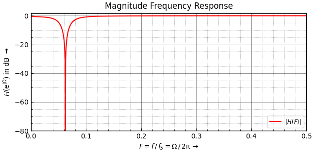
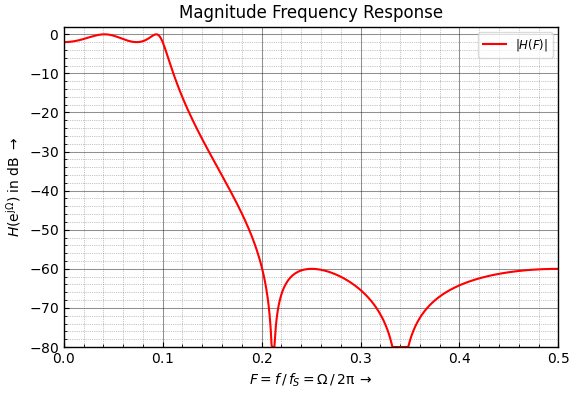

[Back to Teensy](./teensy.md)

---

# USB Audio IIR Filtering with Teensy

An audio signal is fed into the Teensy via its USB audio input, both channels are filtered with biquad IIR filters and streamed to the USB output. 

## Biquad Filter

IIR filters are often constructed from cascaded biquadratic (biquad) or second-order filter section, each with one or two poles and zeros. Splitting a higher order filter / polynome into second-order sections tremendously increases the robustness against coefficient and arithmetic quantization errors. Especially the so-called [direct-form 1 (DF1)](https://ccrma.stanford.edu/~jos/fp/Direct_Form_I.html) topology shown in the following image


is quite robust against internal overflows (only one summation node, two-pole filter section follows two-zero section). THe filter topology is called "direct" because it *directly* implements the difference equation 
$y[n] = b_0  x[n] + b_1  x[n-1] + b_2  x[n-2] - a_1  y[n-1] - a_2  y[n-2]$, yielding the system function

$$
H(z) = \frac{b_0 + b_1  z^{-1} + b_2 z^{-2} }{1 + a_1  z^{-1} + a_2 z^{-2} }.
$$

The widely used CMSIS (Common Microcontroller Software Interface Standard) DSP library uses this sign convention.

Python Scipy / Matlab filter design routines deliver and expect recursive coefficients with opposite sign.

This topology (with CMSIS sign convention) is also used in the Teensy Audio block "Biquad" which implements an IIR filter made of 1 ... 4 cascaded biquad sections, giving a total filter order of up to $N = 8$. The resulting slope between pass and stop band is $N \cdot 20$ dB/dec or $N \cdot 6$ dB/oct.

The filter stages can be configured by using `setLowpass(stage, frequency, Q)`, `setHighpass()`, `setBandpass()` or `setNotch()` where `stage = 0 ... 3` selects the number of the stage, frequency is the corner frequency in Hz and `Q` is a quality factor. For low- and highpass filter this creates resonant peaking for Q > 0.707 which may cause clipping of the signal. For bandpass and notch filter, Q controls the width of passband resp. notch.

Creating a higher order filter with a defined pass and stop-band behaviour this way is quite difficult, probably it is easier to use a filter design tool like pyfda and export the coefficients. These coefficients can be used with `setCoefficients(stage, array[5])`

Configure one stage of the filter (0 to 3) with an arbitrary filter response. The array of coefficients is in order: `b0, b1, b2, a1, a2`. Each coefficient must be $-2.0 < c < 2.0 $ and should be of type 'double'. Alternatively, it may be of type 'int', where 1.0 is represented by $2^{30} = 1073741824$.

[Direct-form 2 (DF2)](https://ccrma.stanford.edu/~jos/filters/Direct_Form_II.html) is another filter topology, See Discussions on 
[IIR Direct Form II Filter Implementation on T eensy 4.0](https://forum.pjrc.com/index.php?threads/iir-direct-form-ii-filter-implementation-on-teensy-4-0.69123/).

Filters with low corner frequencies ($f_c < 400$ Hz for sampling frequency $f_S = 44.1$ kHz or normalized $F_c < 0.01$ Hz) tend to become unstable as the very small coefficients introduce large numerical errors.

The coefficients for the notch filter (left channel) have been generated manually with pyfda with an pole / angle zero of $\pm 22.5 \deg = 2 \pi / 16$ and a pole radius of $r = 0.9$. Tip: Enter poles / zeros in the P/Z tab in polar mode with e.g. "0.9<22.5o" or just "<1/8 p".




The default pyfda filter (low-pass, elliptic, 4th order) has been exported for the right channel. There are two second-order sections to achieve a total order of 4. The resulting magnitude response and pole-zero plan are shown below



## Teensy GUI


## Code

Except for the `setup()` and `loop()` statements, the code has been generated by and exported from the Teensy Audio System Design Tool.

```C
#include <Audio.h>
#include <Wire.h>
#include <SPI.h>
#include <SD.h>
#include <SerialFlash.h>

// GUItool: begin automatically generated code
AudioInputUSB            usb_i;          //xy=385,219
AudioFilterBiquad        biquad_l;       //xy=530,203
AudioFilterBiquad        biquad_r;       //xy=530,236
AudioOutputUSB           usb_o;          //xy=681,219

AudioConnection          patchCord1(usb_i, 0, biquad_l, 0);
AudioConnection          patchCord2(usb_i, 1, biquad_r, 0);
AudioConnection          patchCord3(biquad_l, 0, usb_o, 0);
AudioConnection          patchCord4(biquad_r, 0, usb_o, 1);
// GUItool: end automatically generated code

double coeffs_notch[5] = {
    0.43393598816657514,
    -2.03415958401572e-07,
    0.4339359881665751,
    2.0341595841077975e-07,
    0.13212802366684975
};

// These coefficients could also be specified in a single {...}
double coeffs_lp[2][5] = {
    {
    0.005009993265049967,
    0.005370024900373366,
    0.005009993265049968,
    1.6295801387915057,
    -0.7159415650206529
    },
    {
    1.0,
    -0.47923815089965677,
    1.0,
    1.5523656037391145,
    -0.8935430745699543
    }
};

void setup() {
Serial.begin(9600);
delay(300);

AudioMemory(8);  // allocate buffer memory for audio streams

// Initialize the filter coefficients
biquad_l.setCoefficients(0, coeffs_notch);
for (int i=0; i<NUM_SECTONS; i+=5) { 
    biquad_r.setCoefficients(i, coeffs_lp[i:i-1]);
Serial.println("setup done");
}

unsigned long last_time = millis();

void loop()
{
// print information about processor and memory usage every 2500 ms
if (millis() - last_time >= 2500) {
    Serial.print("Proc = ");
    Serial.print(AudioProcessorUsage());  // usage in percent
    Serial.print(" (");    
    Serial.print(AudioProcessorUsageMax());  // max. processor usage
    Serial.print("),  Mem = ");
    Serial.print(AudioMemoryUsage());  // memory usage in blocks
    Serial.print(" (");    
    Serial.print(AudioMemoryUsageMax()); // max. memory usage in blocks
    Serial.println(")");
    last_time = millis();  // update time variable
    }
}
```

The filter coefficients are imported via `filters_iir.h`

```C
// filters_iir.h
#define NUM_SECTIONS 2  // Number of second-order sections
extern short low_pass[];
// extern short band_pass[];
```

and `filters_iir.cpp`

```C
// filters_iir.cpp
#include "filters_iir.h"
double low_pass[NUM_SECTIONS * 5] = {
#include "lp_1000_44100.h"
};

// double band_pass[NUM_COEFFS] = {
// #include "bp_1200_1700.h"
// };
```

which imports the actual coefficients for an IIR lowpass filter with a passband 0 ... 1000 Hz and a stopband 2000 ... 22050 Hz (f_S/2).

```C
// lp_1000_44100.h
double coeffs_lp[10] = {
    // two sections
    0.005009993265049967, 0.005370024900373366, 0.005009993265049968, 1.6295801387915057, -0.7159415650206529,
    1.0, -0.47923815089965677, 1.0, 1.5523656037391145, -0.8935430745699543
    }
...
## Measurement

Generate a stereo track with 44100 Hz sampling frequency and e.g. 5 s of white noise or a chirp signal. Record the filtered signal.

The recorded signal can be displayed as a time signal, analyzed as a periodogram (Analyze -> Plot Spectrum) or displayed as spectrogram (left panel, right mouse button -> Spectrogram).

## Further experiments / ideas
Swap the sections of the 4th order low-pass filter and compare the achievable SNR and the behaviour for large amplitude inputs.
---

[Back to Teensy](./teensy.md)