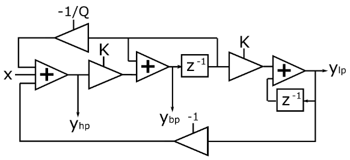

[Back to Teensy](./teensy.md)

---

# USB Audio IIR Filtering with a State-Variable Filter on Teensy

An audio signal is fed into the Teensy via its USB audio input, both channels are filtered with modulated state-variable IIR filters and streamed to the USB output. 

## State-Variable (Chamberlin) Filter

State-variable filters are derived from a state-space description of the discrete-time system, in general they are more robust against coefficient and arithmetic quantization errors than biquad or direct-form filters (should not be used for IIR filters with an order > 2). 



The state-variable topology in the figure above allows controlling the corner frequency in real time via the frequency control input which expects values in the range $-1.0 ... +1.0$. `octaveControl(octaves)` determines how many octaves a full scale input modulates the corner frequency. `frequency(f)` sets the corner frequency in Hz when the control input is 0. The combination of those parameters is used to set the parameter $K$ in the figure below.

The amount of peaking ("Q") can be set with `resonance(Q)` ($0.7 \le Q \le 5.0$) independently and in real-time. Low-pass, high-pass and band-pass output are available at the same time. These features make state-variable filters very attractive for music electronic applications where corner frequency and resonance are modulated to create rich sounds.

This is a second order filter with a rolloff of 20 dB/dec. or 12 dB/oct. Filter stages can be cascaded in order to achieve higher filter orders. An additional zero (and thus a different topology) is needed to implement notch filters.

## Teensy GUI


## Code

Except for the `setup()` and `loop()` statements, the code has been generated by and exported from the Teensy Audio System Design Tool.

```C
#include <Audio.h>
#include <Wire.h>
#include <SPI.h>
#include <SD.h>
#include <SerialFlash.h>

// GUItool: begin automatically generated code
AudioInputUSB            usb_i;          //xy=417,1233
AudioFilterBiquad        biquad;        //xy=588,1281
AudioFilterStateVariable state_variable1;        //xy=591,1233
AudioOutputUSB           usb_o;          //xy=772,1227

AudioConnection          patchCord1(usb_i, 0, state_variable1, 0);
AudioConnection          patchCord2(usb_i, 1, biquad, 0);
AudioConnection          patchCord3(biquad, 0, usb_o, 1);
AudioConnection          patchCord4(state_variable1, 0, usb_o, 0);

// GUItool: end automatically generated code

void setup() {
Serial.begin(9600);
delay(300);

AudioMemory(8);  // allocate buffer memory for audio streams

// Initialize the system
//sine1.frequency(0.5);
//sine1.amplitude(0.9);
state_variable_l.frequency(500.0);
state_variable_l.resonance(1.0);
state_variable_l.octaveControl(1.0);

Serial.println("setup done");
}

unsigned long last_time = millis();

void loop()
{
// print information about processor and memory usage every 2500 ms
if (millis() - last_time >= 2500) {
    Serial.print("Proc = ");
    Serial.print(AudioProcessorUsage());  // usage in percent
    Serial.print(" (");    
    Serial.print(AudioProcessorUsageMax());  // max. processor usage
    Serial.print("),  Mem = ");
    Serial.print(AudioMemoryUsage());  // memory usage in blocks
    Serial.print(" (");    
    Serial.print(AudioMemoryUsageMax()); // max. memory usage in blocks
    Serial.println(")");
    last_time = millis();  // update time variable
    }
}
```

## Measurement

Generate a stereo track with 44100 Hz sampling frequency and e.g. 5 s of white noise or a chirp signal. Record the filtered signal.

The recorded signal can be displayed as a time signal, analyzed as a periodogram (Analyze -> Plot Spectrum) or displayed as spectrogram (left panel, right mouse button -> Spectrogram).

## Further experiments / ideas

---

[Back to Teensy](./teensy.md)