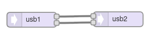

[Back to Teensy](./teensy.md)

<hr>

# USB Audio Loopback with Teensy

A minimum setup for debugging which simply provides a loopback for the audio signal from the USB input to the USB output on the Teensy board.

The TeensyDuino Library is hard-coded for 16-bit, 44.1kHz sample rate, with a 128-sample buffer (2.9ms latency). The USB connection is hard-coded for stereo. During compilation, the Arduino IDE needs to be set to `Tools -> USB Type -> Audio`.

The audio buffer size for all audio connections needs to be set with `AudioMemory(numberBlocks)` during `setup()` where `numberBlocks` is the number of 128 sample blocks, for a start a value of 10 (29 ms) is fine. Higher numbers reserve more memory that might be needed otherwise, lower numbers might cause "hiccups" due to buffer underflows. For debugging, use the function `AudioMemoryUsageMax()`. See the discussion [AudioMemory() - what parameter should I pass?](https://forum.pjrc.com/index.php?threads/audiomemory-what-parameter-should-i-pass.39245/). See the example [teensy_usb_audio_fir_filter.md](./teensy_usb_audio_fir_filter.md) for an example how to use these functions.

The roundtrip latency is higher than that, probably due to additional buffering by the operating system.

The additional `delay()` statements in the setup() part help to avoid some initial glitches in the signal.

Further info: [Teensy Audio over USB](https://openaudio.blogspot.com/2016/10/teensy-audio-over-usb.html) and [PJRC: Audio Connections & Memory](https://www.pjrc.com/teensy/td_libs_AudioConnection.html) showing how to setup Audacity for simultaneous playback and recording.

## Teensy GUI



## Code

Except for the `setup()` and `loop()` statements, the code has been generated by and exported from the Teensy Audio System Design Tool.

```C
#include <Audio.h>
#include <Wire.h>

// GUItool: begin automatically generated code
AudioInputUSB            usb1;
AudioOutputUSB           usb2;

AudioConnection          patchCord1(usb1, 0, usb2, 0);
AudioConnection          patchCord2(usb1, 1, usb2, 1);
// GUItool: end automatically generated code

void setup() {
// put your setup code here, to run once:
delay(50);
AudioMemory(10);
delay(50);
}

void loop() {
// put your main code here, to run repeatedly:
}
```.

## Audacity Experiment

Select "Teensy Audio: USB Audio" as recording and playback device. This is only available when `USB Type: Audio` has been selected during compilitation and when a USB sink and source is used.

Under Linux, you can list playback and recording interfaces with `aplay -l` resp. `arecord -l` (ALSA soundsystem) and `alsamixer`. 

Generate a stereo track with 44100 Hz sampling rate and e.g. a sine or a chirp signal with a duration of 5 s.

Generate another empty stereo track and press the record button. This should send the generated audio signal to the Teensy board and record the processed audio simultaneously, you should see a slightly delayed copy of the input signal.

In order to reduce "hiccups", Audacity needs some buffering. Starting with 100 ms you should be on the safe side. This latency and other delays can be compensated under "latency compensation" by entering a corresponding negative number.

<hr>

[Back to Teensy](./teensy.md)