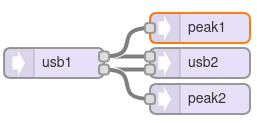

[Back to Teensy](./teensy.md)

<hr>

# USB Audio Loopback with Teensy

A minimum setup for debugging, providing a loopback the audio signal from the USB input to the USB output.

The Arduino Library is hard-coded for 16-bit, 44.1kHz sample rate, with a 128-sample buffer (2.9ms latency). The USB connection is hard-coded for stereo. During compilation, the Arduino IDE needs to be set to `Tools -> USB Type -> Audio`.

The audio buffer size for all audio connections needs to be set with `AudioMemory(numberBlocks)` during `setup()` where `numberBlocks` is the number of 128 sample blocks, for a start a value of 10 (29 ms) is fine. Higher numbers reserve more memory that might be needed otherwise, lower number might cause "hiccups" due to buffer underflows. For debugging, use the function `AudioMemoryUsageMax()`. See the discussion [AudioMemory() - what parameter should I pass?](https://forum.pjrc.com/index.php?threads/audiomemory-what-parameter-should-i-pass.39245/).

The roundtrip latency is higher than that, probably due to additional buffering by the operating system.

Further info: [Teensy Audio over USB](https://openaudio.blogspot.com/2016/10/teensy-audio-over-usb.html) and [PJRC: Audio Connections & Memory](https://www.pjrc.com/teensy/td_libs_AudioConnection.html) showing how to setup Audacity for simultaneous playback and recording.

## Teensy GUI



## Code

Except for the `setup()` and `loop()` statements, the code has been generated by and exported from the Teensy Audio System Design Tool.

```C
#include <Audio.h>
#include <Wire.h>

// GUItool: begin automatically generated code
AudioInputUSB            usb1;
AudioOutputUSB           usb2;

AudioConnection          patchCord1(usb1, 0, usb2, 0);
AudioConnection          patchCord2(usb1, 1, usb2, 1);
// GUItool: end automatically generated code

void setup() {
// put your setup code here, to run once:
AudioMemory(10);
delay(50);
}

void loop() {
// put your main code here, to run repeatedly:
}
```

<hr>

[Back to Teensy](./teensy.md)