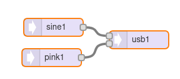

[Back to Teensy](./teensy.md)

---

# USB Audio with a sine on Teensy

A simple experiment generating a sine tone and pink noise, routing both to the USB audio output. This uses the `AudioSynthNoisePink` and `AudioSynthWaveformSine` objects and their methods `amplitude()` and `frequency()` where amplitude is set between 0 and 1 and frequency in Hz.

## Teensy GUI



## Code

```C
#include <Audio.h>
#include <Wire.h>

// GUItool: begin automatically generated code
AudioSynthNoisePink      pink1;
AudioSynthWaveformSine   sine1;
AudioOutputUSB           usb1;

AudioConnection          patchCord1(pink1, 0, usb1, 1);
AudioConnection          patchCord2(sine1, 0, usb1, 0);
// GUItool: end automatically generated code

void setup() {
// put your setup code here, to run once:
sine1.frequency(200);
sine1.amplitude(0.75);
pink1.amplitude(0.75);

AudioMemory(10);
delay(250);
}

void loop() {
// put your main code here, to run repeatedly:
}
```

### Modify the sine frequency with a potentiometer

Use the same code as above, additionally read out an analog input connected to a potentiometer to vary the sine frequency. The example uses the analog input A1 (pin 15). You can also use the volume potentiometer of the Teensy audio shield (if you have one) that is connected to that pin.

```C
...
void loop() {
// put your main code here, to run repeatedly:
sine1.frequency(freq);

}
```

---

[Back to Teensy](./teensy.md)
