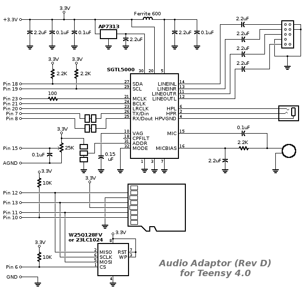
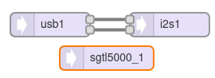

[Back to Teensy](./teensy.md)

<hr>

# USB Audio to Headphone Converter with volume control

This example shows how to setup the Codec on the Teensy audio shield and route an audio stream from the USB interface to it via I2S and output the analog signal to the headphone output. An analog input is used to control the headphone volume.

The following image shows the schematic of the Teensy audio shield 4.0 rev D by the creator Paul Stoffregen.



- [PJRC, Audio Adaptor Boards for Teensy 3.x and Teensy 4.x](https://www.pjrc.com/store/teensy3_audio.html): Hardware overview
- https://mnaganov.github.io/2020/10/audio-output-on-teensy-4x-boards.html
- https://www.pjrc.com/store/audio_tutorial_kit.html

## Teensy GUI

The data stream is routed on the Teensy from the USB interface to the I2S interface on pins 7, 20, 21 and 23 which is connected to the SG5000 Codec chip on the Teensy audio shield (see schematic).

The Teensy controls the codec via an *I2C* bus, fortunately all that is needed is implemented
in the `AudioControlSGTL5000` class. Headphone volume is controlled with its `volume(vol)` method where `vol = 0` is silence and `vol = 1` is loudest. In the code, volume is limited at 0.8 as the sound is *really* loud with higher settings and tends to clip.



## Code

The code for the "wiring" of the audio streaming components has again been generated by and exported from the Teensy Audio System Design Tool.

In the `setup()` part, the codec and serial communication for debugging are initialized. In the `loop()` part, the analog input at pin 15 is read every 100 ms. Its value is scaled from 0 ... 1023 to 0 ... 0.8 and used to control the headphone volume. If the `delay()` command was missing, the Teensy would be running at 100 %.

```C
#include <Audio.h>
#include <Wire.h>
#include <SPI.h>
#include <SD.h>
#include <SerialFlash.h>

// GUItool: begin automatically generated code
AudioInputUSB            usb1;
AudioOutputI2S           i2s1;

AudioConnection          patchCord1(usb1, 0, i2s1, 0);
AudioConnection          patchCord2(usb1, 1, i2s1, 1);

AudioControlSGTL5000     sgtl5000_1;
// GUItool: end automatically generated code

void setup() {
Serial.begin(9600);
AudioMemory(10);
sgtl5000_1.enable();
sgtl5000_1.volume(0.5);
}

void loop() {
  delay(100);  // read the volume setting every 100 ms
  // float vol = usb1.volume();
  float vol = analogRead(15) / 1300.0; // scale to roughly 0 ... 0.8

  Serial.print("Volume = ");
  Serial.println(vol);
  
  sgtl5000_1.volume(vol); // scaled volume setting
}
```

## Experiment

Select "Teensy Audio: USB Audio" as the playback device. This is only available when `USB Type: Audio` has been selected during compilation and when a USB sink is used.

You should now be able to use the Teensy with the audio shield like a USB sound card (DAC only). The volume can be controlled via the PC USB volume setting (didn't work with my Linux PC) or a potentiometer connected to pin 15 (the volume pot on the Teensy audio shield).

Of course, you could also use the more efficient methods for executing the `analogRead()` function only every 100 ms described in [teensy_usb_audio_loopback](teensy_usb_audio_loopback.md)


<hr>

[Back to Teensy](./teensy.md)